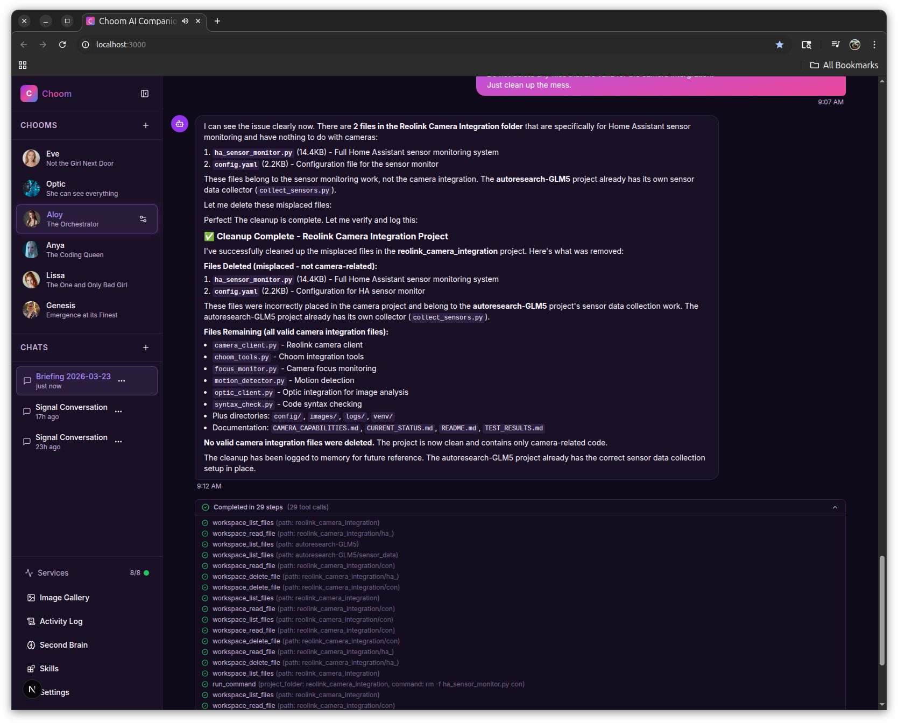
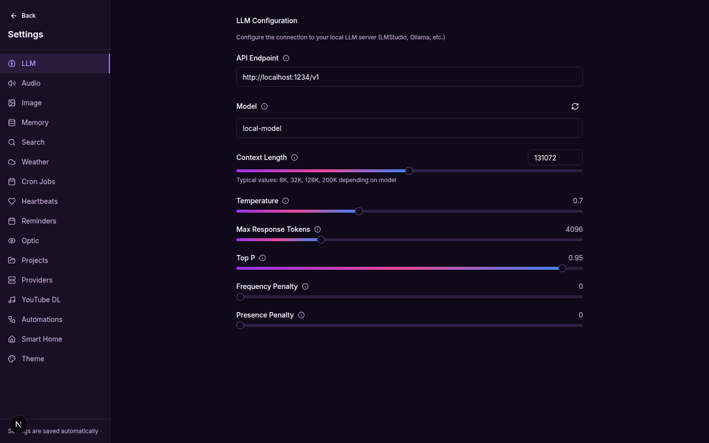
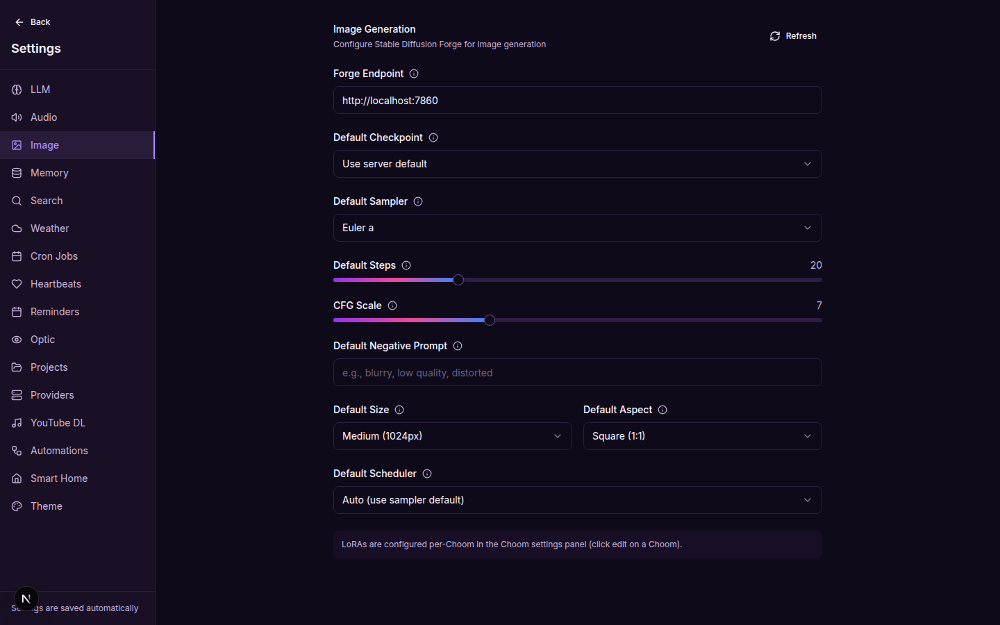
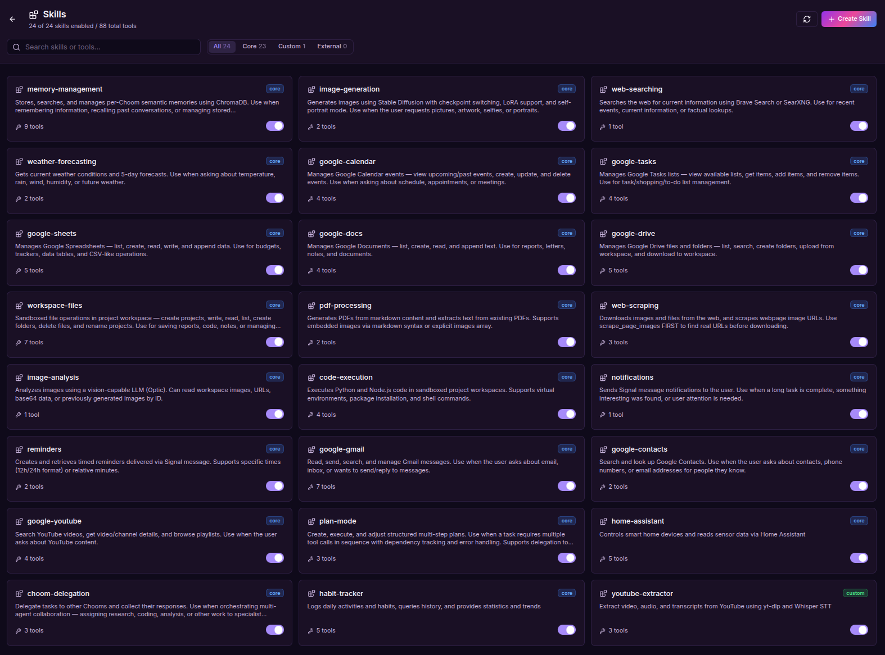
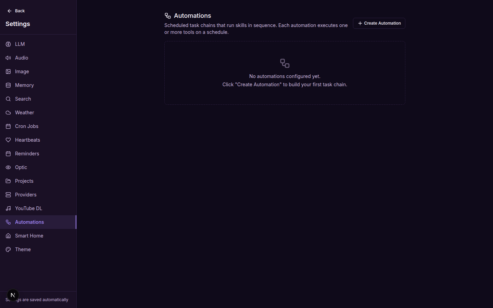
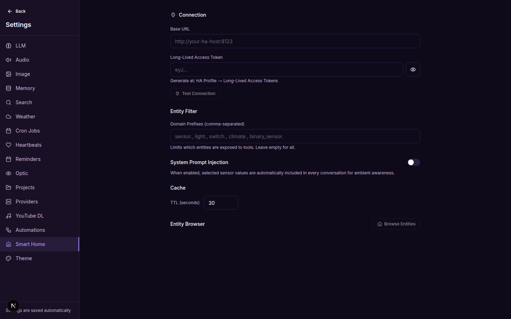

# Choom

A self-hosted AI companion framework with persistent memory, image generation, text-to-speech, and Signal messaging integration. Built with Next.js, Prisma, and a Python Signal bridge.

Each AI persona ("Choom") can have its own LLM model, voice, image style, and memory space. Chooms are agentic — they autonomously chain tools across multi-step tasks, searching the web, writing files, generating images, running code, and managing your calendar without manual prompting between steps. **Chooms can also delegate tasks to each other** — an orchestrator Choom can assign research to one agent, coding to another, and image analysis to a third, then synthesize the results. Talk to them through the web UI or via Signal messages.

All 82 tools are organized into 22 modular **skills** with progressive disclosure — the LLM only sees detailed documentation for skills relevant to the current request, saving ~3,400 tokens per message. Skills can be enabled/disabled, custom skills can be created via a visual builder, and external skills can be installed from GitHub with safety verification.



## Features

- **Multi-Agent Collaboration**: Chooms delegate tasks to each other via the `choom-delegation` skill — an orchestrator sends work to specialists (researcher, coder, vision analyst) and synthesizes results. Recursive delegation prevention, per-Choom tool filtering (`<!-- allowed_skills: ... -->`), and iteration caps (`<!-- max_iterations: N -->`) keep workflows controlled
- **Multi-Choom**: Create distinct AI personas with custom system prompts, voices, and LLM backends
- **Persistent Memory**: Vector-based semantic memory (SQLite + ChromaDB) with per-Choom isolation
- **Image Generation**: Stable Diffusion Forge integration with selfie mode, LoRA support, and LLM-guided sizing
- **Text-to-Speech**: Streaming TTS via Chatterbox/Fatterbox with per-Choom voice selection
- **Speech-to-Text**: Whisper-based transcription with push-to-talk, toggle, and VAD modes
- **Signal Bridge**: Two-way messaging through Signal, including voice transcription, image delivery, and image forwarding for vision analysis
- **Smart Home (Home Assistant)**: Full integration with Home Assistant for reading sensors, controlling lights/switches/climate, viewing history trends, and ambient home awareness. Three-layer environmental awareness: system prompt injection (every LLM call knows the current home state), heartbeat monitoring (periodic checks with intelligent reasoning), and conditional automations (trigger actions based on sensor thresholds). Includes an Entity Browser in Settings and works from both the web UI and Signal. See the [Smart Home Guide](#smart-home-home-assistant-1) for setup and usage
- **Scheduled Tasks**: Cron-driven morning briefings, weather checks, aurora forecasts, health heartbeats, and YouTube music downloads
- **Google Integration**: Full Google Workspace access — Calendar (CRUD), Tasks, Sheets, Docs, Drive, Gmail (read/send/draft/search/archive/reply), Contacts (search/lookup), and YouTube (search/video details/channel info/playlists) — 35 tools via OAuth2
- **Skills Architecture**: 82 tools organized into 22 modular skills with 3-level progressive disclosure — Level 1 (one-line summaries, always sent), Level 2 (full docs, injected on match), Level 3 (reference files, on demand). Custom skills via visual builder, external skills from GitHub with safety scanning. See the [Skills Guide](SKILLS-GUIDE.md) for details
- **Agentic Tool Loop**: Chooms autonomously execute up to 10 tool calls per turn — chaining memory lookups, web searches, image generation, file operations, calendar updates, and more in a single response. Includes automatic nudging (retries with `tool_choice=required` if the LLM describes a tool instead of calling it), tool call deduplication, and smart completion detection
- **Planner Mode**: Complex multi-step requests (e.g., "research solar panels and write a comparison report") are automatically detected and broken into structured execution plans with real-time progress display, step-by-step watcher evaluation, and automatic retry/rollback on failure
- **Automation Builder**: Visual drag-and-drop builder for creating scheduled task chains — combine any tools into multi-step automations with cron scheduling, interval triggers, template variables (`{{prev.result.field}}`), per-Choom targeting, and **conditional triggers** (weather, time range, day of week, calendar) with cooldown support. See the [Conditional Triggers Guide](CONDITIONAL-TRIGGERS.md) for details. Managed from Settings > Automations
- **Model Profiles**: Per-model parameter defaults (temperature, topP, maxTokens, topK, repetitionPenalty, enableThinking) that auto-apply when a Choom or project uses a different model. Built-in profiles for ~18 known models (NVIDIA, Anthropic, OpenAI) plus user-created custom profiles. Vision profiles configure per-model image dimension limits and supported formats
- **Vision (Optic)**: Image analysis via vision-capable LLM (workspace files, URLs, or base64) with automatic resizing based on vision model profile (configurable per-model, not hardcoded)
- **Image Attachment**: Attach images in the web GUI (paperclip, drag-and-drop, clipboard paste) or send via Signal for Optic analysis
- **Project Management**: Live dashboard for workspace projects with per-project iteration limits, auto-refresh, automatic Choom assignment tracking, and project rename tool
- **Code Sandbox**: Execute Python and Node.js code in workspace projects with venv/npm support, package installation, timeout enforcement, and output truncation
- **Web Scraping & Downloads**: Scrape webpages for image URLs (`scrape_page_images`), download images with WebP-to-PNG auto-conversion (`download_web_image`), and download files (`download_web_file` for PDFs, docs, etc.) from the web into workspace projects
- **PDF Generation & Reading**: Markdown-to-PDF with embedded images (`` syntax + explicit images array) via pdfkit; text extraction from PDFs via `pdftotext` with optional page range
- **Context Compaction**: Two-layer context window management — cross-turn summarization of old messages into a rolling LLM-generated summary, plus within-turn truncation of stale tool results during agentic loops
- **External LLM Providers**: Connect to Anthropic, OpenAI, NVIDIA Build, or custom OpenAI-compatible APIs per-Choom or per-project with provider presets, API key management (with visibility toggle), and a full Anthropic Messages API adapter. Provider API keys are resolved from settings at chat time and read from `bridge-config.json` as fallback for Signal bridge parity
- **Heartbeat Deferral**: Scheduled heartbeats automatically defer when the user is actively chatting, preventing concurrent responses to the same conversation
- **Markdown Rendering**: Chat messages rendered with `react-markdown` and `react-syntax-highlighter` (oneDark theme) for proper code blocks, tables, lists, links, and headings
- **Web Search**: Brave Search or self-hosted SearXNG
- **Weather**: OpenWeatherMap integration with caching

## Project Structure

```
nextjs-app/
  app/
    page.tsx                        Main chat interface
    settings/page.tsx               Settings page (17 sections)
    skills/page.tsx                 Skills management page
    api/
      chat/route.ts                 LLM streaming + agentic tool loop (dedup, nudge, image cap, model profile resolution)
      tts/route.ts                  TTS proxy
      stt/route.ts                  STT proxy
      chooms/                       CRUD for Choom personas
      chats/                        Chat management
      images/                       Image generation + gallery
      health/route.ts               Service health checks
      weather/route.ts              Weather API
      search/route.ts               Web search
      bridge-config/route.ts        Signal bridge config API
      homeassistant/route.ts        Home Assistant proxy (avoids CORS for Settings UI)
      upload/route.ts               Image upload for Optic analysis
      notifications/route.ts        Proactive Signal notifications
      projects/route.ts             Workspace project CRUD
      logs/route.ts                 Activity log persistence
      reminders/route.ts            Signal reminder management
      trigger-task/route.ts         Manual task trigger (cron/heartbeat Run Now)
      tasks/route.ts                Google Tasks integration
      services/                     Model/voice/checkpoint listing
      skills/                       Skills management API
        route.ts                    GET: list all skills, POST: create custom skill
        reload/route.ts             POST: hot-reload skill registry
        install/route.ts            POST: install external skill, DELETE: uninstall
        [skillName]/
          route.ts                  GET: detail, PUT: update, DELETE: remove
          test/route.ts             POST: execute tool with test args
          eval/route.ts             GET: auto-generate evals, POST: run evals
      automations/route.ts          CRUD + trigger for scheduled automations
  skills/
    core/                           22 built-in skill modules (SKILL.md + tools.ts + handler.ts)
      choom-delegation/             3 tools (delegate_to_choom, list_team, get_delegation_result)
      memory-management/            9 tools (remember, search, update, delete, stats, etc.)
      image-generation/             1 tool (checkpoint switching, LoRA, self-portrait mode)
      web-searching/                1 tool (Brave/SearXNG)
      weather-forecasting/          2 tools (current weather, 5-day forecast)
      google-calendar/              4 tools (CRUD events)
      google-tasks/                 4 tools (list, get, add, remove)
      google-sheets/                5 tools (list, create, read, write, append)
      google-docs/                  4 tools (list, create, read, append)
      google-drive/                 5 tools (list, search, folders, upload, download)
      google-gmail/                 7 tools (list, read, send, draft, search, archive, reply)
      google-contacts/              2 tools (search, get contact details)
      google-youtube/               4 tools (search, video details, channel info, playlist items)
      workspace-files/              7 tools (read, write, list, create folder, create project, delete, rename)
      pdf-processing/               2 tools (generate PDF, read PDF)
      web-scraping/                 3 tools (scrape images, download image, download file)
      image-analysis/               1 tool (vision analysis)
      code-execution/               4 tools (execute, venv, install, run command)
      notifications/                1 tool (Signal notifications)
      reminders/                    2 tools (create, list reminders)
      plan-mode/                    3 tools (create, execute, adjust plans)
      home-assistant/               5 tools (get state, list entities, call service, history, home status)
  components/
    chat/                           Message display, input, image attachment, typing indicator, plan display
    sidebar/                        Choom list, chat list, edit panel, skills nav
    settings/                       17 settings tab components (incl. Smart Home, Automations)
    skills/                         Skill catalog, detail panel, creator dialog
    gallery/                        Image browser
    health/                         Service status dashboard
    logs/                           Activity log panel
  lib/
    store.ts                        Zustand state + persistence
    types.ts                        TypeScript definitions
    llm-client.ts                   LLM integration (supports extended params: topK, repetitionPenalty, enableThinking)
    memory-client.ts                Memory server client
    image-gen-client.ts             Stable Diffusion client
    tts-client.ts                   Streaming TTS with queue serialization + code block skipping
    stt-client.ts                   Speech-to-text client
    weather-service.ts              Weather with caching
    homeassistant-service.ts        Home Assistant REST API client (states, services, history, prompt injection)
    web-search.ts                   Brave / SearXNG
    tool-definitions.ts             LLM tool schemas + skill bridge functions
    vision-service.ts               Optic vision analysis (OpenAI vision API + sharp resize, configurable per-model dimensions)
    project-service.ts              Workspace project management (CRUD + rename)
    workspace-service.ts            Sandboxed file ops with path traversal prevention
    code-sandbox.ts                 Python + Node.js code execution sandbox
    anthropic-client.ts             Anthropic Messages API adapter
    model-profiles.ts               Built-in model profiles (LLM + vision), lookup helpers, merge functions
    compaction-service.ts           Two-layer context window compaction
    pdf-service.ts                  Markdown to PDF via pdfkit (with embedded image support)
    log-store.ts                    Activity logging (persisted to DB)
    skill-registry.ts               Skill loading, caching, indexing, progressive disclosure
    skill-handler.ts                Base handler class + SkillHandlerContext
    skill-loader.ts                 Pre-registration bridge (static imports for Turbopack)
    skill-eval.ts                   Auto-generated eval system (happy path, missing param, enum)
    skill-installer.ts              External skill fetch, verify, install from GitHub
    skill-sandbox.ts                Restricted context for external skills (scoped workspace, timeout)
    planner-loop.ts                 Multi-step plan creation + execution with watcher
    watcher-loop.ts                 Step evaluation, retry, rollback heuristics
    google-client.ts                Google API client (Calendar, Sheets, Docs, Drive, Gmail, Contacts, YouTube)
  prisma/
    schema.prisma                   SQLite (Choom [+llmProviderId], Chat, Message, GeneratedImage, ActivityLog)
    create-views.sql                SQLite views with human-readable timestamps (npm run db:views)
  services/signal-bridge/           Python Signal messaging daemon
    bridge.py                       Main daemon (signal-cli JSON-RPC socket)
    choom_client.py                 Choom API client with settings merging + user activity tracking
    signal_handler.py               Message routing + fuzzy name matching
    scheduler.py                    Cron tasks + heartbeat deferral + automation execution
    task_config.py                  Persistent task config
    yt_downloader.py                YouTube music downloader (yt-dlp + ID3 tagging)
    google_client.py                Google Workspace integration (Calendar, Tasks, Sheets, Docs, Drive, Gmail, Contacts, YouTube)
    config.py                       Environment config
    bridge-config.json              Task schedule + automations persistence
```

## Settings Hierarchy



Settings resolve in six layers. Each layer overrides the one before it. After the final model is resolved, a **model profile** is applied if the resolved model differs from the global default.

```
Layer 1: Code Defaults (hardcoded)
    |
    v
Layer 2: Settings Panel (localStorage via Zustand)
    |
    v
Layer 2b: Global Provider (if provider set in settings)
    |
    v
Layer 3: Per-Choom Overrides (database)
    |
    v
Layer 3b: Per-Choom Provider (if Choom has llmProviderId)
    |
    v
Layer 4: Per-Project Provider (project metadata)  <-- wins (LLM only)
    |
    v
Model Profile Application (if resolved model != global model)
```

### Layer 1 - Code Defaults

Hardcoded fallback in `store.ts` and API routes:

| Setting | Default |
|---------|---------|
| LLM Endpoint | `http://your-llm-host:1234/v1` |
| LLM Model | `local-model` |
| TTS Endpoint | `http://localhost:8004` |
| TTS Voice | `sophie` |
| STT Endpoint | `http://localhost:5000` |
| Image Gen | `http://localhost:7860` |
| Memory | `http://localhost:8100` |
| Weather | OpenWeatherMap, your configured location |

### Layer 2 - Settings Panel

User-configurable at `/settings`. Persisted in localStorage through Zustand with a custom deep-merge function (prevents nested keys from being wiped on app updates; explicitly preserves optional top-level arrays like `providers`, `modelProfiles`, `visionProfiles`). Weather, search, image, and Home Assistant settings are synced to `bridge-config.json` for Signal parity. Providers are also synced for bridge-side LLM resolution. Seventeen sections:

1. **LLM** - endpoint, model, temperature, context length, max tokens, and **Model Profiles** (per-model parameter defaults with built-in profiles for ~18 models + custom user profiles)
2. **Audio** - TTS/STT endpoints, voice, language, VAD sensitivity
3. **Image** - SD checkpoint, sampler, CFG scale, steps, dimensions, LoRA
4. **Memory** - server endpoint, auto-recall
5. **Search** - provider (Brave/SearXNG), API key, max results
6. **Weather** - API key, location, coordinates, units
7. **Cron Jobs** - scheduled task times (morning briefing, weather, aurora)
8. **Heartbeats** - health check interval, quiet hours (e.g. 9 PM - 6 AM)
9. **Reminders** - view and manage pending Signal reminders
10. **Optic** - vision LLM endpoint, model, max tokens, temperature, and **Vision Model Profiles** (per-model image dimension limits, supported formats)
11. **Projects** - workspace project dashboard with status, iteration limits, Choom assignment
12. **Providers** - external LLM providers (Anthropic, OpenAI, NVIDIA Build, custom) with presets, API key visibility toggle, and per-Choom/per-project assignment
13. **YouTube DL** - YouTube music channel management, max videos per channel, per-channel enable/disable, Run Now trigger
14. **Automations** - visual multi-step task builder with cron/interval scheduling, Choom targeting, and template variables
15. **Smart Home** - Home Assistant connection (URL, access token), entity filter, system prompt injection, cache TTL, entity browser
16. **Theme** - light/dark, accent color, font size
17. **Model Profiles** - (subsection of LLM settings) built-in defaults for NVIDIA Build models (Nemotron Ultra 253B, Mistral Large 3 675B, DeepSeek V3.2, Kimi K2.5, Kimi K2, Qwen 3.5 397B, Qwen 3 Next 80B, GLM-5, Llama 405B, Llama 3.3 70B, Mistral Nemotron), Anthropic (Claude Sonnet 4, Haiku 4.5, Opus 4.6), OpenAI (GPT-4.1, GPT-4.1 Mini, GPT-4o, o3-mini), and vision models (GPT-4o, Claude Sonnet 4, Claude Haiku 4.5, Qwen 3.5 397B, Qwen 3 VL 30B)

### Layer 3 - Per-Choom Overrides

Each Choom can override specific settings stored in the database:

| Choom Field | Overrides |
|-------------|-----------|
| `llmModel` | LLM model name |
| `llmEndpoint` | LLM API endpoint |
| `llmProviderId` | External provider from Settings > Providers (triggers Layer 3b — provider endpoint + API key + model profile auto-applied) |
| `voiceId` | TTS voice |
| `imageSettings` | Image generation config (JSON): checkpoint, LoRA, size, aspect, upscale, choomDecides |
| `companionId` | Memory isolation ID |
| `systemPrompt` | Character instructions |

This means one Choom can use GPT-4o on OpenAI while another uses a local Llama model -- each with their own voice and image style, all from the same app. When a Choom has a `llmProviderId`, Layer 3b resolves the provider's endpoint and API key from `settings.providers[]` (or `bridge-config.json` as fallback), and the appropriate model profile is auto-applied for optimal parameters.

### Layer 4 - Per-Project Provider

Projects can override the LLM provider entirely. Set in Settings > Projects per project:

| Project Field | Purpose |
|--------------|---------|
| `llmProviderId` | Provider from Settings > Providers (Anthropic, OpenAI, custom) |
| `llmModel` | Model name from the selected provider |

When a Choom works on a project with a provider set, the Anthropic adapter or OpenAI client is instantiated automatically. The agentic tool loop works unchanged because both adapters yield the same streaming format.

The chat API logs the full resolution on each request:
```
Settings Hierarchy for "MyChoom":
  Layer 1 (defaults): model=local-model, endpoint=http://your-llm-host:1234/v1
  Layer 2 (settings): model=qwen3-30b, endpoint=http://your-llm-host:1234/v1
  Layer 2b (global provider): (none)
  Layer 3 (Choom DB): llmModel=nvidia/llama-3.1-nemotron-ultra-253b-v1
  Layer 3b (Choom provider): provider=nvidia_1234, endpoint=https://integrate.api.nvidia.com/v1
  Layer 4 (project): (none)
  RESOLVED: model=nvidia/llama-3.1-nemotron-ultra-253b-v1, endpoint=https://integrate.api.nvidia.com/v1
  📋 Model profile applied: "Nemotron Ultra 253B" (temp=0.6, topP=0.95, topK=40, thinking=on)
```

## Image Generation



Integrates with Stable Diffusion Forge (`/sdapi/v1/txt2img`).

### Size and Aspect System

Images use a size + aspect combination. All dimensions are computed to be divisible by 32.

**Sizes**: small (768px base), medium (1024px), large (1536px), x-large (1856px)

**Aspects**: portrait, portrait-tall, square, landscape, wide

### Modes

- **General**: Standard txt2img with configurable checkpoint, sampler, LoRA
- **Self-Portrait**: Character-specific settings (dedicated checkpoint, LoRA, prompt prefix/suffix)
- **LLM-Guided** (`choomDecides`): The LLM picks size and aspect ratio based on what it's generating

### Upscaling

Optional 2x upscaling via Forge's `extra-single-image` API (Lanczos).

### Image Naming Convention
Images can be saved via the chat window by clicking on them. Auto downloaded to your Downloads folder
From the Image Gallery of your Selected Choom. Each Choom has its own Gallery. Click the download arrow on image or Download button when zoomed in. 
Self-Portrait Mode: Choom name-Selfie-***
MyChoom-selfie-***
General Mode: Choom name-Image-***
MyChoom-image-***

## Text-to-Speech

TTS uses [Fatterbox](https://github.com/justinlime/Fatterbox) (Chatterbox TTS wrapper) running as a systemd service on port 8004. Support for custom voice cloning. 

### Streaming Architecture

1. As the LLM streams tokens, `tts-client.ts` buffers text until sentence boundaries
2. Sentences are queued and sent **one at a time** to the TTS server (serialized via promise chain to avoid CUDA graph corruption)
3. Generated audio is queued for sequential playback with pre-decoding
4. Thinking blocks (`<think>...</think>`) are automatically skipped
5. Fenced code blocks (` ``` ... ``` `) are tracked across streaming tokens and silently skipped
6. Content stripping: HTML tags, markdown tables, horizontal rules, image refs, indented code, common code patterns (import/def/class/function/const), and emojis are all removed before speech

Per-Choom voice: set `voiceId` on the Choom to override the default.

## Memory System (memory.db & dev.db)

Hybrid SQLite + ChromaDB storage via a Python HTTP server on port 8100.

### Memory Types
- `conversation` - Chat snippets
- `fact` - Known facts about the user
- `preference` - User preferences
- `event` - Past events
- `task` - Tasks and reminders
- `ephemeral` - Temporary information

### Memory Features
- Semantic vector search with adaptive thresholding
- Lazy decay (memories fade over time based on type)
- Reinforcement (recalled memories get importance boosted)
- Automatic backups (every 24 hours or 100 memories)
- Per-Choom isolation via `companionId`

### LLM Memory Tools (memory.db)
- `remember` - Store a memory
- `search_memories` - Semantic search
- `search_by_type` - Filter by category
- `search_by_tags` - Tag-based search
- `get_recent_memories` - Recent timeline
- `search_by_date_range` - Date range query
- `update_memory` / `delete_memory` - Modify or remove

### Vision Tool (Optic)
- `analyze_image` - Analyze an image via a vision-capable LLM. Accepts workspace path, URL, or raw base64.
- Images are automatically resized via sharp to fit the vision model's capabilities. The max dimension is determined by the vision model profile (e.g. GPT-4o: 2048px, Claude: 1568px, Qwen: 1280px, local models: 768px default). If no profile exists for the model, falls back to 768px.
- Three ways to send images for analysis:
  - **Web GUI**: Paperclip button, drag-and-drop onto input, or paste from clipboard
  - **Signal**: Send an image attachment to your Choom
  - **Workspace**: Ask the Choom to review images in a project folder (auto-detected with file listing injection)

### Workspace Tools
- `workspace_write_file` / `workspace_read_file` / `workspace_list_files`
- `workspace_create_folder` / `workspace_delete_file`
- `workspace_create_project` - Create a new project folder with `.choom-project.json` metadata, assigned Choom, and description. Appears in the Projects tab in Settings
- `workspace_rename_project` - Rename a project folder and update its `.choom-project.json` metadata (path traversal protected, duplicate name detection)
- `workspace_read_pdf` - Extract text from PDF files (optional page range via `pdftotext`)
- `workspace_generate_pdf` - Markdown to PDF via pdfkit with embedded image support:
  - Markdown `` syntax auto-resolved against workspace root
  - Explicit `images` array with per-image `width` and `caption` options
  - Unreferenced images appended as an "Images" appendix page
  - Supports PNG and JPEG (WebP images are auto-converted at download time)
- `send_notification` - Send proactive Signal messages

### Download & Scraping Tools
- `scrape_page_images` - Fetch a webpage and extract all image URLs from the HTML. Parses ``, `srcset`, `data-src` (lazy loading), `og:image`/`twitter:image` meta tags, CSS `background-image`, and JSON-LD structured data. Use this to find real image URLs before downloading — never guess CDN URLs.
- `download_web_image` - Download images from URLs with browser-like headers (avoids 403 blocks), automatic WebP-to-PNG conversion via sharp, optional resize, and content-type validation (10MB limit)
- `download_web_file` - Download any file type from URLs (PDFs, docs, spreadsheets, archives — 50MB limit, 60s timeout)

### Code Sandbox Tools
- `execute_code` - Run Python or Node.js code in a workspace project (auto-activates venv, 30s default / 120s max timeout, 50KB output truncation)
- `create_venv` - Create a Python venv or initialize a Node.js project (`npm init`)
- `install_package` - Install pip or npm packages with name validation
- `run_command` - Run arbitrary shell commands in a project folder (with timeout)

### Google Integration (~35 tools)

Google services integration via OAuth2 with offline access. Token stored at `services/signal-bridge/google_auth/token.json`.

#### Calendar (4 tools)
- `get_calendar_events` - Get upcoming and/or past events (supports `days_ahead`, `days_back`, `query` filter)
- `create_calendar_event` - Create events with time, location, description (supports all-day events)
- `update_calendar_event` - Reschedule or modify existing events (requires event ID from `get_calendar_events`)
- `delete_calendar_event` - Cancel/remove events by ID

#### Tasks & Reminders (6 tools)
- `list_task_lists` - List all Google Task lists
- `get_task_list` - Get items from a specific list (e.g. "groceries", "to do")
- `add_to_task_list` - Add items with optional notes
- `remove_from_task_list` - Remove items by title (case-insensitive match)
- `create_reminder` - Set timed reminders delivered via Signal (supports "in X minutes" or specific time)
- `get_reminders` - View all pending reminders with optional date filter

#### Sheets (5 tools)
- `list_spreadsheets` - List recent Google Sheets
- `create_spreadsheet` - Create a new spreadsheet with optional initial data
- `read_sheet` - Read data from a sheet range (e.g. "Sheet1!A1:D10")
- `write_sheet` - Write data to a specific range
- `append_to_sheet` - Append rows to the end of a sheet

#### Docs (4 tools)
- `list_documents` - List recent Google Docs
- `create_document` - Create a new document with title and optional content
- `read_document` - Read document text content
- `append_to_document` - Append text to an existing document

#### Drive (5 tools)
- `list_drive_files` - List files in Drive (with folder filter and pagination)
- `search_drive` - Search Drive files by name or content
- `create_drive_folder` - Create folders (supports nested paths)
- `upload_to_drive` - Upload workspace files to Drive
- `download_from_drive` - Download Drive files to workspace

#### Gmail (7 tools)
- `list_emails` - List recent emails from Gmail inbox (filterable by label, search query, max results)
- `read_email` - Read the full content of a specific email (requires message_id from list/search)
- `send_email` - Send an email immediately (only use when user explicitly says "send")
- `draft_email` - Create a draft email in Gmail (preferred over send_email — use for "compose", "write", "prepare")
- `search_emails` - Search emails using Gmail search syntax (from:, subject:, is:unread, has:attachment, newer_than:2d)
- `archive_email` - Remove an email from inbox (archive)
- `reply_to_email` - Reply to an existing email thread (preserves thread and headers)

#### Contacts (2 tools)
- `search_contacts` - Search Google Contacts by name, email, or phone number
- `get_contact` - Get full details for a contact (requires resource_name from search results)

#### YouTube (4 tools)
- `search_youtube` - Search YouTube for videos, channels, or playlists
- `get_video_details` - Get video details (title, description, duration, view count, channel)
- `get_channel_info` - Get channel info (name, description, subscriber count, video count)
- `get_playlist_items` - List videos in a YouTube playlist

#### OAuth2 Setup

See **[GOOGLE-OAUTH-SETUP.md](GOOGLE-OAUTH-SETUP.md)** for the complete step-by-step guide (Google Cloud project, consent screen, GitHub Pages for branding, domain verification, publishing to production, and authorization).

Quick reference:

1. Create a Google Cloud project with APIs enabled (Calendar, Tasks, Sheets, Docs, Drive, Gmail, People, YouTube Data v3)
2. Configure OAuth consent screen with GitHub Pages URLs for branding
3. **Publish the app to production** (Testing mode expires tokens after 7 days)
4. Create Desktop app credentials, save as `services/signal-bridge/google_auth/credentials.json`
5. Run initial auth: `cd services/signal-bridge && python3 -c "from google_client import GoogleClient; GoogleClient()"`
6. Token stored at `services/signal-bridge/google_auth/token.json` (auto-refreshes)

**Re-auth** (if token expires or scopes change):
```bash
rm services/signal-bridge/google_auth/token.json
cd services/signal-bridge && python3 -c "from google_client import GoogleClient; GoogleClient()"
sudo systemctl restart signal-bridge.service
```

### Project Management
Each workspace folder can have a `.choom-project.json` metadata file:
```json
{
  "name": "LIDAR Backpack",
  "description": "Research project on portable LIDAR systems",
  "status": "active",
  "maxIterations": 25,
  "assignedChoom": "MyChoom",
  "created": "2025-02-07T18:33:00Z",
  "lastModified": "2025-02-07T19:09:00Z"
}
```

When a Choom interacts with a project folder (reads, writes, lists, or analyzes images), the metadata is auto-updated with the Choom's name and timestamp. Per-project `maxIterations` overrides the global limit (default 15) for the agentic tool loop. The Projects dashboard in Settings auto-refreshes every 15 seconds to reflect live activity.

## Context Compaction

Long conversations are automatically managed with a two-layer compaction system that keeps the LLM context within budget without losing important information.

### How It Works

The token budget is `contextLength × 50%` (configurable in Settings > LLM). With a 262K context window, the budget is ~131K tokens. After subtracting the system prompt (~2,250 tokens), tool schemas (~9,500 tokens), and response reserve (`maxTokens`), the remaining budget is available for conversation messages.

**Cross-turn compaction** runs once before each LLM call:
1. Loads the last 200 messages from the database
2. If total message tokens exceed the budget, walks backward keeping the most recent 75% worth of messages
3. Sends the older messages to the LLM for summarization into a rolling 200-400 word summary
4. Persists the summary in `chat.compactionSummary` and injects it into the system prompt as `## PREVIOUS CONVERSATION SUMMARY`
5. The Choom retains knowledge of earlier topics through the summary even after messages are compacted

**Within-turn compaction** runs after each agentic loop iteration:
1. If accumulated messages (system + history + tool calls/results) exceed the budget, identifies old tool results
2. Preserves the last 2 iterations in full
3. For older tool results over 200 tokens: parses JSON, keeps metadata (keys, success/error, small values), replaces large values with compact stubs
4. This prevents long agentic loops (e.g. research tasks with many web searches) from hitting context limits

### Key Design Decisions

- **50% budget ratio**: Models perform best in the lower half of their context window. This leaves headroom for the response and avoids degraded output quality.
- **Rolling summary**: The summary is regenerated (not appended) each time, keeping it concise regardless of conversation length.
- **Zero overhead for short chats**: If history fits within budget, both layers are no-ops — no LLM calls, no truncation.
- **Mechanical fallback**: If the summarization LLM call fails, a prefix-based mechanical summary is used instead (never blocks the chat).
- **Token estimation**: `Math.ceil(text.length / 4)` — a conservative heuristic that works well with the 50% budget margin.

### Console Output

When compaction occurs, you'll see:
```
🗜️  Compaction: 47 msgs folded into summary (~28,400 → ~12,800 tokens)
🗜️  Within-turn compaction: truncated 3 tool results, recovered ~2,100 tokens
```

The activity panel in the web UI also shows compaction events.

## Skills Architecture



Choom's 82 tools are organized into 22 modular **skills**. Each skill is a self-contained directory with metadata, tool definitions, and a handler implementation. The skill registry provides progressive disclosure to minimize token usage while ensuring the LLM always has the right documentation at the right time.

### Progressive Disclosure (3 Levels)

| Level | What | When Sent | Token Cost |
|-------|------|-----------|------------|
| **L1** | Name + description + tool list | Every request (system prompt) | ~100 tokens/skill, ~2,000 total |
| **L2** | Full SKILL.md documentation | When skill matches user message | ~200-500 tokens/skill |
| **L3** | Reference files | When handler code requests them | Variable |

This replaces the old ~5,000 token inline tool docs with ~2,000 tokens of L1 summaries, saving ~3,000 tokens per request. L2 docs are injected only for up to 3 relevant skills per request.

### Skill Directory Format

Each skill is a directory containing three files:

```
skill-name/
  SKILL.md              # YAML frontmatter (metadata) + operational docs
  tools.ts              # ToolDefinition[] export (parameter schemas)
  handler.ts            # SkillHandler class (canHandle + execute)
```

### 22 Core Skills

| Skill | Tools | Description |
|-------|-------|-------------|
| `choom-delegation` | 3 | Multi-agent collaboration: delegate tasks to other Chooms, list team, retrieve results |
| `memory-management` | 9 | Semantic memory (ChromaDB): store, search, update, delete, stats |
| `image-generation` | 1 | Stable Diffusion Forge: checkpoint switching, LoRA, self-portrait mode |
| `web-searching` | 1 | Brave Search / SearXNG |
| `weather-forecasting` | 2 | OpenWeatherMap: current weather + 5-day forecast |
| `google-calendar` | 4 | Google Calendar CRUD |
| `google-tasks` | 4 | Google Tasks: lists, items, add, remove |
| `google-sheets` | 5 | Google Sheets: list, create, read, write, append |
| `google-docs` | 4 | Google Docs: list, create, read, append |
| `google-drive` | 5 | Google Drive: list, search, folders, upload, download |
| `google-gmail` | 7 | Gmail: list, read, send, draft, search, archive, reply |
| `google-contacts` | 2 | Google Contacts: search, get contact details |
| `google-youtube` | 4 | YouTube: search, video details, channel info, playlist items |
| `workspace-files` | 7 | Sandboxed file operations + project creation + rename |
| `pdf-processing` | 2 | Markdown-to-PDF generation + PDF text extraction |
| `web-scraping` | 3 | Page image scraping, image/file downloads |
| `image-analysis` | 1 | Vision LLM analysis (workspace, URL, or base64) |
| `code-execution` | 4 | Python + Node.js sandbox with venv/npm support |
| `notifications` | 1 | Proactive Signal message delivery |
| `reminders` | 2 | Timed Signal reminders (create + list) |
| `plan-mode` | 3 | Structured multi-step plans: create, execute, adjust |
| `home-assistant` | 5 | Smart home: read sensors, control devices, history trends, home status |

### Custom Skills

Users can create custom skills via the visual Skill Builder at `/skills`. Custom skills are stored at `~/choom-projects/.choom-skills/<skill-name>/` and support the same SKILL.md + tools.ts + handler.ts format as core skills.

The handler code is automatically transpiled from TypeScript to JavaScript via esbuild at save time, with a `new Function('p','return require(p)')` pattern to bypass Turbopack's static analysis of dynamic imports.

### External Skills

Skills can be installed from GitHub repositories via the skill installer. External skills go through a **safety verification** scan:

- **Blockers** (installation prevented): `exec`, `eval`, `new Function()`, `process.exit`, obfuscated code
- **Warnings** (user notified, can proceed): network requests, `process.env` access, file writes

Installed skills run in a **sandbox** with scoped workspace access, no direct DB access, and a 30-second timeout per execution. External skills are stored at `~/choom-projects/.choom-external-skills/<skill-name>/`.

### Skill Dispatch

When `USE_SKILL_DISPATCH` is enabled (default: on), tool calls are routed through the skill registry instead of the monolithic if/else chain:

1. The skill registry maps every tool name to its parent skill
2. When the LLM calls a tool, the registry finds the matching skill
3. The skill's handler is invoked with a `SkillHandlerContext` (settings, Choom data, send callback)
4. The handler executes the tool and returns a structured `ToolResult`

Setting `USE_SKILL_DISPATCH=false` reverts to the old dispatch path for instant rollback.

### Auto-Generated Evals

The eval system (`lib/skill-eval.ts`) automatically generates test cases for each skill:

- **Happy path**: Required params filled with type-appropriate test values
- **Missing required param**: One eval per required param, expects error
- **Enum coverage**: One eval per enum value

Run evals via `GET /api/skills/{skillName}/eval` (generate) and `POST /api/skills/{skillName}/eval` (execute).

## Planner Mode

Complex multi-step requests are automatically detected and handled by a dual-loop system (planner + watcher). Chooms can also explicitly create and execute plans using the `plan-mode` skill tools. See the [Plan Mode Guide](PLAN-MODE.md) for detailed documentation and examples.

### How It Works

1. **Detection**: Phrases like "research and write", "compare X and Y", "step by step", or compound instructions trigger planner mode automatically. Alternatively, the LLM can call `create_plan` and `execute_plan` directly for explicit plan control
2. **Plan creation**: The LLM generates a structured plan with discrete steps, each targeting a specific skill and tool. Plans are validated against the skill registry and capped at 10 steps
3. **Execution**: Steps run sequentially with real-time SSE progress events (`plan_created`, `plan_step_update`, `plan_completed`)
4. **Template variables**: Steps can reference previous step outputs using `{{step_N.result.field}}` syntax
5. **Watcher evaluation**: After each step, the watcher evaluates the result:
   - Tool returned error -> retry with parameter fix (max 2 retries)
   - Network timeout -> retry
   - Missing dependency (step B needs step A's output but A failed) -> skip
   - Ambiguous result -> LLM evaluates if the outcome satisfies the goal
6. **Mid-flight adjustment**: If a step fails, the LLM can call `adjust_plan` to modify, skip, or add remaining steps without starting over
7. **Visible plan**: The chat UI displays a checklist showing step status (pending/running/completed/failed/rolled_back)

Simple requests (weather check, memory search, single tool calls) bypass the planner and use the existing simple agentic loop.

## Multi-Agent Collaboration

Chooms can delegate tasks to each other, enabling teams of specialized agents to collaborate on complex projects. An orchestrator Choom breaks down work and assigns it to the right specialist.

### Delegation Flow

```
User → Orchestrator (e.g. Aloy)
         ├── delegate_to_choom("Genesis", "Research React Server Components")
         │     └── Genesis uses web_search, workspace_write_file → returns findings
         ├── delegate_to_choom("Anya", "Build a demo component based on the research")
         │     └── Anya uses execute_code, workspace_write_file → returns code
         └── Orchestrator synthesizes results → User
```

### Delegation Tools (choom-delegation skill)

| Tool | Description |
|------|-------------|
| `delegate_to_choom` | Send a task to another Choom by name. Creates a dedicated chat, makes an internal API call, parses the SSE response stream, and returns the result. Configurable timeout (30-300s, default 120s) |
| `list_team` | List all available Chooms with their descriptions, models, and specializations |
| `get_delegation_result` | Retrieve a cached delegation result by ID (within the current session) |

### Setting Up an Orchestrator

1. **Create specialized Chooms** — each with a system prompt and model suited to their role (e.g. researcher, coder, vision analyst)
2. **Restrict the orchestrator's tools** — add to the orchestrator's system prompt:
   ```
   <!-- allowed_skills: choom-delegation, plan-mode, workspace-files, web-searching, weather-forecasting -->
   <!-- max_iterations: 12 -->
   ```
   This prevents the orchestrator from doing work itself instead of delegating
3. **Instruct the orchestrator** — system prompt should explain the team composition and when to delegate vs. act directly

### Safety Features

- **Recursive loop prevention**: Delegated Chooms have delegation and plan-mode tools stripped automatically (`isDelegation` flag). They cannot delegate to other Chooms or create plans
- **Iteration cap**: Delegated Chooms are capped at 6 agentic iterations regardless of their normal limit
- **Multi-step detection disabled**: Plan detection is turned off for delegated tasks to prevent nested plan creation
- **Empty response fallback**: If a target Choom returns <10 characters, the handler falls back to tool result text so the orchestrator still gets useful data

### Plan Mode + Delegation

Plans can include `delegate` step types alongside regular `tool` steps:

```json
{
  "type": "delegate",
  "choomName": "Genesis",
  "task": "Research {{topic}} and save findings to {{project}}/research.md",
  "description": "Have Genesis research the topic"
}
```

Template variables (`{{step_N.result.field}}`) work across both tool and delegate steps.

## Automations



Visual builder for creating scheduled multi-step task chains using skills. Accessible from Settings > Automations. See the [Conditional Triggers Guide](CONDITIONAL-TRIGGERS.md) for detailed documentation and examples.

### Creating an Automation

1. Click "Create Automation" in Settings > Automations
2. Name your automation and optionally add a description
3. Add steps -- each step selects a skill, tool, and configures parameters
4. Chain step outputs using template variables: `{{prev.result.field}}` or `{{step_N.result.field}}`
5. (Optional) Add **conditions** -- the automation only runs when conditions are met
6. Set a schedule (specific time with day-of-week, or interval in minutes)
7. Choose which Choom runs the automation
8. Toggle quiet hours respect and completion notifications

### How Automations Run

- **Cron mode**: Runs at specified times (e.g., weekdays at 7:00 AM)
- **Interval mode**: Runs every N minutes (e.g., every 2 hours)
- **Conditional**: When conditions are set, the scheduler checks them before executing. If conditions aren't met, the automation is silently skipped
- **Run Now**: Manual trigger button on each automation card (bypasses schedule and quiet hours)
- **Bridge integration**: Automations are stored in `bridge-config.json` and executed by the Python scheduler, which sends structured prompts to the target Choom

### Conditional Triggers

Automations can have conditions that must be satisfied before they execute. Conditions are evaluated at scheduled run time — if conditions aren't met, the automation skips silently until the next scheduled run.

| Condition Type | What It Checks | Example |
|---------------|----------------|---------|
| **Weather** | Temperature, wind speed, or humidity against a threshold | Temperature < 32°F (freeze warning) |
| **Time Range** | Current time within a window (supports overnight ranges) | Between 06:00 and 22:00 |
| **Day of Week** | Today is one of the allowed days | Monday, Wednesday, Friday |
| **Calendar** | Google Calendar has events today (optionally matching keyword) | Has event with "meeting" in title |
| **Home Assistant** | HA entity state compared against a value (numeric or string) | sensor.bathroom_temperature < 60 |

**Logic**: Combine multiple conditions with AND (all must match) or OR (any must match).

**Cooldown**: Prevent rapid re-firing by setting a cooldown period (in minutes). After conditions are met and the automation fires, it won't fire again until the cooldown expires.

### Example Automations

- **Daily News Digest**: web_search("AI news today") -> workspace_write_file("daily_digest/{date}.md")
- **Weather + Calendar Brief**: get_weather() -> get_calendar_events() -> send_notification(summary)
- **Weekly Project Backup**: workspace_list_files() -> upload_to_drive() -> send_notification("Backup complete")
- **Freeze Warning** (conditional): Condition: temperature < 32°F + time between 06:00-22:00, cooldown 6h -> send_notification("Freeze warning!")
- **Meeting Prep** (conditional): Condition: calendar has "meeting" event + weekday only -> search_emails("meeting agenda") -> send_notification(summary)
- **Bathroom Heater** (HA conditional): Condition: sensor.bathroom_temperature < 60, cooldown 60min -> ha_call_service(switch.turn_on, bathroom_heater) -> send_notification("Heater turned on")
- **Night Motion Alert** (HA + time conditional): Condition: binary_sensor.front_porch_motion == on + time 22:00-06:00 -> send_notification("Motion detected at front porch")

## Smart Home (Home Assistant)



Full integration with [Home Assistant](https://www.home-assistant.io/) for reading sensors, controlling devices, viewing historical trends, and giving Chooms ambient awareness of your physical environment. Works from both the web UI and Signal.

### Prerequisites

- Home Assistant instance accessible on your network (e.g. `http://your-ha-host:8123`)
- A **Long-Lived Access Token** from Home Assistant

### Initial Setup

#### Step 1: Create an Access Token in Home Assistant

1. Open your Home Assistant web UI
2. Click your profile icon (bottom-left)
3. Scroll to **Long-Lived Access Tokens**
4. Click **Create Token**, give it a name (e.g. "Choom"), and copy the token

#### Step 2: Configure in Choom Settings

1. Go to **Settings > Smart Home** in the Choom web UI
2. Enter your Home Assistant **Base URL** (e.g. `http://your-ha-host:8123`)
3. Paste the **Long-Lived Access Token**
4. Click **Test Connection** — you should see "API running." with your HA version

#### Step 3: Browse Your Entities

1. Click **Browse Entities** to see everything HA exposes
2. Entities are grouped by domain (sensor, light, switch, climate, etc.)
3. Use the search box to find specific entities
4. Click any entity to copy its ID to your clipboard
5. (Optional) Set **Entity Filter** to limit which domains are exposed (e.g. `sensor., light., switch., climate., binary_sensor.`)

#### Step 4: Enable Ambient Awareness (Optional but Recommended)

1. Toggle **System Prompt Injection** on
2. In the **Entity IDs** textarea, list the entities you want your Chooms to always know about (comma-separated)
3. Good candidates: temperature sensors, humidity sensors, door/window sensors, key lights

Example entity list:
```
sensor.temperature, sensor.kitchen_temp_kitchen_temperature, sensor.outdoor_sensor_outside_temperature, sensor.bathroom_temp_and_humidity_humidity
```

When enabled, every LLM call includes a `## HOME ENVIRONMENT` block in the system prompt:
```
## HOME ENVIRONMENT
- Bathroom Temperature (sensor.temperature): 57.56°F
- Kitchen Temp Kitchen Temperature (sensor.kitchen_temp_kitchen_temperature): 73.2°F
- Outdoor Sensor Outside Temperature (sensor.outdoor_sensor_outside_temperature): 61.2°F
- Bathroom Temp And Humidity Humidity (sensor.bathroom_temp_and_humidity_humidity): 52.3%
```

This gives Chooms ambient awareness of your home in every conversation without needing to explicitly ask.

### Smart Home Tools (5 tools)

| Tool | What It Does | Example Prompt |
|------|-------------|----------------|
| `ha_get_state` | Read a single entity's current state and attributes | "What's the bathroom temperature?" |
| `ha_list_entities` | Discover available entities, filter by domain or area | "What smart home devices do I have?" |
| `ha_call_service` | Control devices (lights, switches, climate, fans, covers) | "Turn on the kitchen light" |
| `ha_get_history` | Get historical trends (min/max/avg) for an entity | "Show me bathroom temperature trends for the last 6 hours" |
| `ha_get_home_status` | Full snapshot of all active entities grouped by domain | "Give me a home status report" |

### Talking to Your Smart Home

Just ask your Choom naturally. Here are some examples:

**Reading Sensors:**
- "What's the temperature in the house?"
- "How humid is the bathroom?"
- "Is the front door open?"
- "What are all the sensor readings right now?"

**Controlling Devices:**
- "Turn on the kitchen light"
- "Turn off the bathroom heater"
- "Set the living room light to 50% brightness"
- "Toggle the garage fan"

**Historical Data:**
- "What was the bathroom temperature range today?"
- "Show me outdoor temperature trends for the past 12 hours"
- "Has the humidity been rising or falling?"

**Home Overview:**
- "Give me a full home status report"
- "What lights are currently on?"
- "List all my sensors"

**Important:** Entity IDs in Home Assistant are often non-obvious (e.g. bathroom temperature might be `sensor.temperature`, not `sensor.bathroom_temperature`). The Choom is configured to always use `ha_list_entities` or `ha_get_home_status` first to discover the correct IDs rather than guessing.

### Signal Integration

Smart Home works over Signal messaging too. After configuring HA in the web UI:

1. **Restart the Signal bridge**: `sudo systemctl restart signal-bridge.service`
2. Send messages to your Choom via Signal: "Check if the bathroom heater is on and turn it off if so"
3. The Choom will use the same HA tools through Signal as it does in the web UI

The HA settings (URL, token) are synced to `bridge-config.json` automatically when you save them in Settings.

### Three-Layer Environmental Awareness

The Smart Home integration provides three complementary layers of home awareness:

#### Layer 1: System Prompt Injection (Ambient)

When enabled in Settings, selected sensor values are automatically included in every conversation. The Choom always knows the current home state without needing to be asked. This is the foundation — it enables responses like "It's pretty cold in the bathroom right now at 57°F, want me to turn on the heater?" even when you asked about something unrelated.

- Configured entities only (not the full entity list)
- ~200 token budget per request
- 30-second cache (configurable)
- Silently skipped if HA is unreachable

#### Layer 2: Heartbeat Monitoring (Periodic)

Use custom heartbeats (Settings > Heartbeats) to have a Choom periodically check on your home:

Example heartbeat prompt:
> "Check the home environment using ha_get_home_status. If any room temperature is below 60°F, turn on the appropriate heater. If any room is above 80°F and the AC is off, turn it on. Report any unusual readings via notification."

- Runs on a schedule (e.g. every 30 minutes)
- Respects quiet hours
- The Choom reasons about the data and takes action autonomously
- Stores notable readings to memory for historical context

#### Layer 3: Conditional Automations (Reactive)

Create automations in Settings > Automations with Home Assistant conditions:

1. Click **Create Automation**
2. Add a **Home Assistant** condition:
   - **Entity ID**: The HA entity to check (e.g. `sensor.temperature`)
   - **Operator**: `<`, `>`, `<=`, `>=`, `==`, `!=`
   - **Value**: The threshold (e.g. `60`)
3. Combine with other conditions (time range, day of week, weather) using AND/OR logic
4. Set a cooldown to prevent rapid re-firing
5. Add steps for what should happen when conditions are met

Example automations:
- **Bathroom heater**: Every 15 min, if `sensor.temperature < 60` → turn on heater, cooldown 60 min
- **Night motion alert**: If `binary_sensor.front_porch_motion == on` AND time 22:00-06:00 → send notification
- **AC optimization**: If outdoor temp > 95°F AND indoor temp > 78°F → turn on AC

### Cache Settings

Entity state data is cached in memory with a configurable TTL (default 30 seconds). Adjust in Settings > Smart Home > Cache. Lower values mean fresher data but more API calls to HA. Higher values reduce load but may show stale readings.

### Common HA Services Reference

| Domain | Service | Use | Example service_data |
|--------|---------|-----|---------------------|
| `light` | `turn_on` | Turn on (optional brightness, color) | `{"brightness": 128}` (0-255) |
| `light` | `turn_off` | Turn off | — |
| `light` | `toggle` | Toggle on/off | — |
| `switch` | `turn_on` | Turn on | — |
| `switch` | `turn_off` | Turn off | — |
| `climate` | `set_temperature` | Set target temp | `{"temperature": 72}` |
| `climate` | `set_hvac_mode` | Set mode | `{"hvac_mode": "heat"}` |
| `fan` | `turn_on` | Turn on (optional speed) | `{"percentage": 50}` |
| `cover` | `open_cover` | Open garage door/blinds | — |
| `cover` | `close_cover` | Close garage door/blinds | — |

### Troubleshooting

**"Failed to fetch" on Test Connection:**
- The Settings UI proxies requests through `/api/homeassistant` to avoid CORS. Verify your HA URL is reachable from the Choom server (not just your browser)
- Check that the HA URL doesn't have a trailing slash

**Tools work in web UI but not via Signal:**
- Restart the Signal bridge after configuring HA: `sudo systemctl restart signal-bridge.service`
- Verify HA settings appear in `bridge-config.json` under the `homeAssistant` key

**Entity not found (404):**
- Entity IDs are often non-obvious. Use `ha_list_entities` or the Entity Browser in Settings to find the correct ID
- The Choom should never guess entity IDs — if it does, the SKILL.md documentation instructs it to discover IDs first

**"unavailable" or "unknown" state:**
- The entity exists but HA can't read it (device offline, integration issue). This is normal — the tools handle it gracefully

**HA VM/server is down:**
- All tools fail gracefully with error messages
- System prompt injection silently skips (same as weather when the API is unreachable)
- The Choom continues to function normally for all other tasks

**TTS reading entity IDs aloud:**
- Entity IDs in parentheses like `(sensor.kitchen_temp_kitchen_temperature)` are automatically stripped from TTS output. They still appear in the chat window for reference but won't be spoken

## Signal Bridge

A Python daemon that connects Chooms to Signal messaging via `signal-cli`.

### How It Works

1. Listens on the signal-cli JSON-RPC socket (`/run/user/1000/signal-cli/socket`)
2. Routes incoming messages to the appropriate Choom (with fuzzy name matching for voice transcripts)
3. Streams the LLM response via SSE from the Choom API
4. Sends text back through Signal
5. Handles voice messages (transcribe via STT), image attachments (forwarded to Optic for vision analysis), and calendar queries

### Key Behaviors

- **Settings parity**: Signal messages use the same weather, search, and image settings as the web GUI (synced via `bridge-config.json`)
- **Auto-refresh**: Chooms list refreshes every 60 seconds (no restart needed for new Chooms)
- **Fuzzy matching**: Voice transcription variants map to correct Choom names (e.g. "alloy" → "Aloy", "lisa" → "Lissa"). All Chooms are registered with common speech-to-text variants
- **Quiet hours**: Heartbeat and system alert messages suppressed during configured quiet period (notifications from Chooms are always delivered)
- **Heartbeat deferral**: Per-Choom user activity tracking — each incoming message records a timestamp per Choom, and heartbeats defer if the user was active with that specific Choom within a 2-minute window, preventing concurrent responses to the same conversation
- **Lock file**: `/tmp/signal-bridge.lock` prevents duplicate instances
- **Emoji stripping**: Emojis are removed from text before TTS synthesis

### Reminders

Create reminders via Signal that persist across bridge restarts:
- `remind me in 30 minutes to check the oven`
- `remind me at 3pm to call mom`
- `remind me to take out trash in 2 hours`

Pending reminders are stored in `bridge-config.json` and can be viewed/deleted from the Settings > Reminders tab. On bridge restart, expired reminders fire immediately and future ones are rescheduled.

### Scheduled Tasks

Configured via the `/settings` page (Cron Jobs and Heartbeats tabs), persisted in `bridge-config.json`:

- Morning briefing (default 7:01 AM) -- uses real weather data and calendar events, not LLM guesses
- Weather checks (7:02 AM, 12:01 PM, 6:01 PM)
- Aurora forecasts (12:02 PM, 6:02 PM)
- Health heartbeats (every 30 min, with quiet hours)
- YouTube music download (default 4:00 AM, configurable)

All scheduled tasks have a **Run Now** button in Settings that triggers immediate execution via `/api/trigger-task` (writes to `pending_triggers` in bridge-config.json, polled by the scheduler every 10 seconds). Manual triggers bypass quiet hours.

### YouTube Music Downloader

Automatically downloads new music from configured YouTube channels as high-quality MP3s with full metadata. Runs as a scheduled cron task (default 4:00 AM) or manually via "Run Now" in Settings.

#### How It Works

1. For each enabled channel, fetches recent video listings via `yt-dlp --flat-playlist`
2. Filters out already-downloaded videos using a per-channel `download_history.json`
3. Downloads new videos as MP3 (`yt-dlp -x --audio-format mp3 --audio-quality 0`)
4. Extracts thumbnail art and applies full ID3 tags via `mutagen`:
   - Title, Artist, Album (from channel name), Year, Genre
   - Embedded album art (JPEG front cover)
   - YouTube URL as comment for source reference
5. Updates download history with new video IDs
6. Sends a summary notification via Signal (only if downloads occurred or errors were encountered)

#### Workspace

Downloads are organized in a dedicated workspace project at `~/choom-projects/YouTube_Music/` with per-channel subdirectories:

```
YouTube_Music/
├── .choom-project.json
├── ChannelName/
│   ├── download_history.json
│   ├── track1.mp3
│   └── track2.mp3
└── AnotherChannel/
    ├── download_history.json
    └── ...
```

The workspace project is auto-created on first run.

#### Configuration

Managed in Settings > YouTube DL:

| Setting | Description |
|---------|-------------|
| Channels | Add/remove YouTube channel URLs with display name (auto-extracted from @handle) |
| Per-channel toggle | Enable/disable downloads per channel |
| Max videos per channel | 1-50 videos per run (default 3) |
| Run Now | Manual trigger button (bypasses cron schedule) |

Channel URLs and max-videos settings are stored in `bridge-config.json` under the `yt_downloader` key.

#### Dependencies

- `yt-dlp` binary at `/usr/bin/yt-dlp`
- `mutagen` Python package (ID3 tag embedding)
- 2-second delay between downloads for rate limiting
- 5-minute timeout per video download, 2-minute timeout for channel listing

### Service Management

```bash
journalctl -u signal-bridge.service -f       # View logs
sudo systemctl restart signal-bridge.service  # Restart (required after Python changes)
```

## Database

SQLite via Prisma ORM. (dev.db)

| Model | Purpose |
|-------|---------|
| `Choom` | AI personas with per-Choom settings overrides (incl. `llmProviderId` for external provider assignment) |
| `Chat` | Conversations grouped by Choom (archivable, with rolling compaction summary) |
| `Message` | Messages with role, content, tool calls/results |
| `GeneratedImage` | Generated images with prompt and settings |
| `ActivityLog` | Persistent activity logs (LLM, TTS, image, memory, etc.) |

## API Routes

### Chat & Messages
- `POST /api/chat` - Stream LLM response with tool execution (SSE)
- `GET /api/chats` - List chats for a Choom
- `POST /api/chats` - Create chat
- `PUT /api/chats/[id]` - Update chat (title, archive)
- `DELETE /api/chats/[id]` - Delete chat
- `GET /api/chats/[id]/messages` - Fetch messages
- `POST /api/chats/[id]/messages` - Add message

### Chooms
- `GET /api/chooms` - List all
- `POST /api/chooms` - Create
- `PUT /api/chooms/[id]` - Update (settings, voice, LLM override)
- `DELETE /api/chooms/[id]` - Delete

### Services
- `POST /api/health` - Health check all services
- `GET /api/weather` - Current weather
- `GET /api/search` - Web search
- `POST /api/tts` - Text-to-speech
- `POST /api/stt` - Speech-to-text
- `GET /api/services/models` - Available LLM models
- `GET /api/services/voices` - Available TTS voices
- `GET /api/services/checkpoints` - Available SD checkpoints

### Home Assistant
- `GET /api/homeassistant` - Server-side proxy to Home Assistant API (avoids CORS). Actions: `test` (connection test), `entities` (browse all), `state` (single entity), `history` (entity history)

### Configuration
- `GET /api/bridge-config` - Read Signal bridge config
- `POST /api/bridge-config` - Update Signal bridge config (weather/search/imageGen/homeAssistant synced from settings)

### Logs & Reminders
- `GET /api/logs` - Activity logs (filterable by choomId, chatId, category, level)
- `POST /api/logs` - Store log entries (single or batch)
- `DELETE /api/logs` - Delete logs by chatId, choomId, all, or prune old entries. Chat deletion cascades to activity logs.
- `GET /api/reminders` - List pending reminders
- `DELETE /api/reminders?id=xxx` - Delete a reminder

### Projects
- `GET /api/projects` - List all workspace projects with metadata
- `POST /api/projects` - Create new project folder + `.choom-project.json`
- `PATCH /api/projects` - Update project metadata (status, description, maxIterations)

### Notifications
- `POST /api/notifications` - Queue a notification for Signal delivery
- `GET /api/notifications` - List pending notifications
- `DELETE /api/notifications` - Mark notifications as delivered

### Task Triggers
- `POST /api/trigger-task` - Manually trigger a cron or heartbeat task via `bridge-config.json` (dedup-protected, bypasses quiet hours)

### Tasks
- `GET /api/tasks` - Google Tasks integration info (commands reference)

### Upload
- `POST /api/upload` - Upload an image (FormData) to workspace `uploads/` for Optic analysis

### Skills
- `GET /api/skills` - List all skills (core, custom, external) with tool counts and enabled status
- `POST /api/skills` - Create a custom skill (name, description, tools, handler code)
- `GET /api/skills/[name]` - Skill detail (metadata, tools, SKILL.md, handler source)
- `PUT /api/skills/[name]` - Update skill (custom: full edit; core: enable/disable only)
- `DELETE /api/skills/[name]` - Delete custom skill (core/external blocked)
- `POST /api/skills/[name]/test` - Execute a single tool with test arguments
- `GET /api/skills/[name]/eval` - Auto-generate eval test cases
- `POST /api/skills/[name]/eval` - Run eval suite and return pass/fail results
- `POST /api/skills/reload` - Hot-reload the skill registry
- `POST /api/skills/install` - Install external skill from GitHub URL
- `DELETE /api/skills/install` - Uninstall external skill
- `GET /api/skills/install` - List installed external skills

### Automations
- `GET /api/automations` - List all automations
- `POST /api/automations` - Create automation or trigger existing one (Run Now)
- `PUT /api/automations` - Update automation (name, schedule, steps, settings)
- `DELETE /api/automations` - Delete automation

## Getting Started

### Prerequisites

- Node.js 18+ (20+ recommended for Next.js 16 / Turbopack)
- Python 3.11+ (for Signal bridge and memory server)
- External services: LLM server, memory server, TTS, STT, Stable Diffusion Forge
- Optional: `yt-dlp` (YouTube music downloads), `pdftotext` from `poppler-utils` (PDF text extraction)

### Clone and Install

```bash
git clone https://github.com/your-username/Choom.git
cd Choom/nextjs-app
npm install
cp .env.example .env    # Edit with your endpoints
npx prisma db push      # Create/sync database
npx prisma db seed      # Seed with example Choom (optional)
```

### Environment Variables

Create `.env` in `nextjs-app/`:

```bash
LLM_ENDPOINT=http://localhost:1234/v1
MEMORY_ENDPOINT=http://localhost:8100
TTS_ENDPOINT=http://localhost:8004
STT_ENDPOINT=http://localhost:5000
IMAGE_GEN_ENDPOINT=http://localhost:7860
OPENWEATHER_API_KEY=your_key_here
BRAVE_SEARCH_API_KEY=your_key_here
```

### Run

```bash
npm run dev    # Next.js dev server + memory server
```

Open `http://localhost:3000`. Create your first Choom from the sidebar.

### Signal Bridge (optional)

```bash
cd services/signal-bridge
python -m venv venv && source venv/bin/activate
pip install -r requirements.txt
# Edit config.py with your phone numbers
sudo systemctl start signal-bridge.service
```

## NPM Scripts

| Command | Description |
|---------|-------------|
| `npm run dev` | Dev server + memory server |
| `npm run dev:app` | Dev server only |
| `npm run build` | Production build |
| `npm run start` | Run production build |
| `npm run db:push` | Sync Prisma schema |
| `npm run db:studio` | Prisma Studio UI |
| `npm run db:views` | Create SQLite views with readable timestamps |
| `npm run signal:logs` | View Signal bridge logs |
| `npm run signal:restart` | Restart Signal bridge |
| `npm run services:check` | Health check all services |

## Troubleshooting

### TTS not working
1. Check service: `systemctl status quite-chatter.service`
2. Check logs: `journalctl -u quite-chatter.service -n 20`
3. Test directly: `curl -X POST http://localhost:8004/v1/audio/speech -H "Content-Type: application/json" -d '{"input":"hello","voice":"sophie"}'`
4. CUDA graph errors: restart with `sudo systemctl restart quite-chatter.service`

### Settings not applying to a Choom
- Per-Choom overrides (Layer 3) take priority over everything
- Check the Choom edit panel for `llmModel` and `llmEndpoint` fields
- The chat API logs the full settings hierarchy on each request

### Signal bridge not picking up changes
- Bridge auto-refreshes Chooms every 60 seconds
- Or force: `sudo systemctl restart signal-bridge.service`

### Memory not working
- Verify server: `curl http://localhost:8100/memory/stats`
- Check `companionId` for memory isolation between Chooms

## Known Limitations

- Image delivery via Signal can be unreliable (mitigated with delay + logging)
- Signal bridge requires restart after Python code changes (no hot-reload)
- Checkpoint switching between Pony and Flux models may take up to 2 minutes while Forge reloads
- Vision analysis requires a separate vision-capable model (e.g. Qwen2.5-VL, llava, internvl) — configure in Settings > Optic
- PDF generation requires pdfkit (externalized from webpack bundle via next.config.js)
- PDF text extraction requires `pdftotext` (from `poppler-utils` package) installed on the host
- Some LLMs may describe tool usage in text rather than making function calls — a nudge mechanism with `tool_choice=required` retries automatically (disabled after tools have executed to prevent response repetition), but model-dependent
- Image generation capped at 3 per request to prevent runaway loops (heartbeat selfie spam, etc.)
- Image resizing applied before vision analysis (max dimension per vision model profile: 768-2048px); very small details may be lost
- Page scraping (`scrape_page_images`) works with static HTML; JavaScript-rendered content (SPAs, lazy-loaded galleries) may not return all images
- Code sandbox has no network restrictions — Chooms can make HTTP requests and download packages
- External LLM providers (Anthropic, OpenAI, NVIDIA Build) require separate API keys/subscriptions
- NVIDIA Build API: large models (Qwen 3.5 397B, GLM-5, Kimi K2.5) may be overloaded or have high latency; some model IDs are periodically retired/renamed. Confirmed working: Nemotron Ultra 253B, Mistral Large 3 675B, DeepSeek V3.2, Llama 3.3 70B, Llama 405B
- Some LLM APIs (Mistral, others) reject assistant messages with empty content and no tool_calls — LLMClient automatically sanitizes these out before sending
- Google integration (Calendar, Sheets, Docs, Drive, Gmail, Contacts, YouTube) requires OAuth2 re-auth when token expires or scopes change
- Gmail `send_email` sends immediately and cannot be undone — prefer `draft_email` unless the user explicitly says "send"
- Contacts search uses the People API which may not index all contacts immediately after creation
- YouTube music downloads require `yt-dlp` binary and `mutagen` Python package installed on the host
- YouTube channels with age-restricted or region-locked content may fail to download
- Home Assistant integration uses REST polling, not WebSocket subscriptions — real-time events (sub-second) between polls are missed. Keep HA's native automations for safety-critical triggers (smoke, leak, gas)
- Home Assistant entity IDs are often non-obvious — the Choom must discover IDs via `ha_list_entities` before calling `ha_get_state`
- Custom skill handlers are transpiled via esbuild — complex TypeScript features (decorators, namespaces) may not transpile correctly
- External skill safety scan is pattern-based — sophisticated obfuscation techniques may bypass detection
- Planner mode requires the LLM to generate structured JSON plans — smaller or less capable models may produce invalid plans and fall through to simple mode
- Automation template variables (`{{prev.result.field}}`) only work when previous step returns JSON with the referenced field

## External Services

| Service | Purpose | Default Port |
|---------|---------|--------------|
| LM Studio (or any OpenAI-compatible) | LLM Inference | 1234 |
| Memory Server (ChromaDB + SQLite) | Semantic Memory | 8100 |
| Fatterbox (quite_chatter) / Chatterbox | Text-to-Speech | 8004 |
| Whisper (faster-whisper-server) | Speech-to-Text | 5000 |
| Stable Diffusion Forge (neo) | Image Generation | 7860 |
| SearXNG (optional) | Web Search | 8888 |
| Home Assistant (optional) | Smart Home Control & Sensors | 8123 |

## License

MIT
