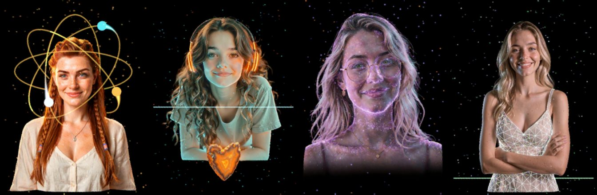
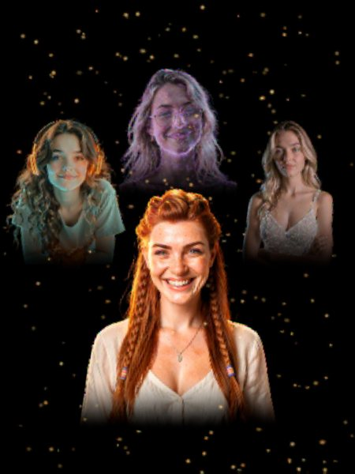
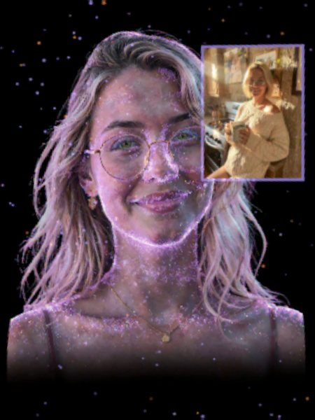
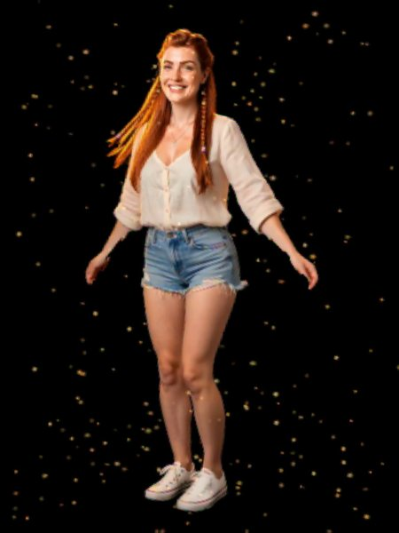

# Chooms in Glass

The four Chooms (Aloy, Optic, Genesis and Eve) living in a [Looking Glass Portrait](https://lookingglassfactory.com),
a holographic display that shows 48 views at once, so they stand in the glass in real depth. Whoever
is talking comes to the glass, speaks in her own voice, and moves with what is going on in the Choom
app: listening, thinking, using tools, sleeping at night.



<sub>Each picture is rebuilt from what the panel shows: the center view of its 48.</sub>

## What it does

- **Moving reliefs.** Each Choom is dozens of short clips made from her own render, with depth on
  every frame, played like a shuffled deck so nothing repeats soon. Now and then the glass cuts to
  her whole figure for a few seconds and back.
- **Voice and lip sync.** Replies are spoken in her voice from the speaker on the tower, with her
  lips following the words.
- **Talking at the tower.** Say "OK Aloy" (or Optic, Genesis, Eve) and she turns to listen; "OK
  Chooms" talks to the group room. Typing or the mic in the app works too.
- **Eye contact.** With a camera by the glass, she turns to you when you look at her.
- **The glass camera.** A Camera tab in the Choom app's settings shows its live picture (for
  aiming it), its adjustments, and whether the Chooms may take a snapshot with it.
- **Welcome back.** Sit down after a while away and the Choom you last talked with welcomes you
  back, asking about whatever you'd told her you were off to do.
- **Expressions and moments.** Happy, surprised, sad or concerned when the conversation calls for it;
  a look that fits each tool she uses; pictures she makes float beside her.
- **Selfies.** A selfie she makes comes with a "look at me" move, sometimes a full-body twirl.
- **Outfits.** Clothes by the hour and the weather (Aloy: a sweater in the evening, a jacket when
  it's cold), changed with a camera cut.
- **Group stage.** In a group room all four stand together, the speaker in front.
- **Days and nights.** She dozes off late at night and wakes in the morning; with Home Assistant she
  greets you when you get home or sit down, and sleeps when you go to bed. Wind, rain and snow
  outside show in the glass.

| | |
|:---:|:---:|
|  |  |
| The group stage | A picture she made |
|  |  |
| A full-body move | Asleep, the glass dimmed |

## Hardware

- **Looking Glass Portrait**, connected by HDMI (video) and USB-C (power, calibration, buttons).
- **A PC with a GPU** to drive it, here an RTX PRO 6000 in a NUC. It renders the 48 views, runs the
  wake-phrase listener, and makes the moving reliefs.
- **A speakerphone** for her voice and the microphone, here an EMEET OfficeCore M0 Plus.
- **A camera** at the Portrait's top edge for eye contact, here a Logitech MX Brio (optional).
- **Optional:** Home Assistant with presence sensors.

## Setup

1. Copy the Portrait's calibration file from its USB drive into `calibration/`.
2. Install the udev rule for the Portrait's buttons (see the [reference](docs/reference.md#portrait-buttons-and-screens)).
3. For talking at the tower and eye contact: `python3 -m venv .venv-ears && .venv-ears/bin/pip install faster-whisper==1.2.1 ctranslate2==4.8.2 webrtcvad-wheels mediapipe opencv-python-headless`.
4. Point it at the Choom app: `export CHOOM_URL=http://<choom-host>:3000`.
5. Optional, Home Assistant: put `ha_url`, `ha_token` and `presence.json` in `~/.config/choom-hologram`
   (see the [reference](docs/reference.md#presence-home-assistant)).
6. Run `./launch.sh` (and `./launch.sh stop` to close it).
7. To make clips, looks and sequences: set paths in `~/.config/choom-hologram/studio.json` and open
   Glass Studio at http://127.0.0.1:8767 (see [studio/README.md](studio/README.md)).

## Using it

| | |
|---|---|
| "OK Aloy", "OK Optic", "OK Genesis", "OK Eve" | that Choom listens; your words go to her chat |
| "OK Chooms", "OK girls", "OK everyone" | the group room (the Signal room) |
| wait for the chime after she answers | the mic is open eight seconds for your reply, no name needed (after a welcome back too) |
| look at the glass | she turns to you (with the camera on top) |
| Portrait buttons | previous Choom, next Choom, hold to talk over her |

## How it works

```
Choom app (Mac)  --events, voice-->  server.py  -->  living.js (Chrome, full-screen on the Portrait)
      ^                                  ^                 |
      |  speech-to-text, "talk"          |                 +-- lenticular.js: 48 views, factory calibration
      +--------  tower_ears.py  ---------+                 +-- moving reliefs, lip sync, stage, particles
                 (microphone)        Home Assistant (presence)
```

- `living.js` renders each Choom as a moving RGB-D relief and interleaves 48 views with the
  Portrait's own calibration; no Looking Glass software is needed.
- `server.py` relays the Choom app's live feed, proxies her voice, serves pictures, watches Home
  Assistant and the Portrait's buttons.
- `tower_ears.py` listens for a wake phrase locally and sends what you say to the Choom app.
- The Choom app mirrors every turn to the hologram and speaks only conversations someone at home has open.

The moving reliefs are made with Wan2GP (MiniMax H3 clips from each Choom's cleaned render),
U2-Net cut-outs, Depth Anything V2 depth and MediaPipe mouth tracking: see the
[technical reference](docs/reference.md) for the pipeline, configuration and debugging.

## Glass Studio

[Glass Studio](studio/README.md) is the workshop for all of this, at http://127.0.0.1:8767 on the GPU
machine. It plans clips for a Choom from a library of actions that have worked on the glass, renders
them with Wan2GP (now, or tonight), shows each one as a contact sheet with automatic checks for the
usual failures (fog, a camera push-in, a colour shift, a seam, a cut), and lets you keep, drop or
re-roll it. Her clips on the glass are arranged by drag and drop, look by look, with how many
minutes of quiet moments she has before one repeats; *Build* puts them on the glass when she's
quiet. Every clip's prompt, seed and decision is kept in her project file.

Start with [your first Choom on the glass](studio/docs/tutorial-new-choom.md) on a fresh install, or
[a new outfit for a Choom you have](studio/docs/tutorial-outfit.md).

The Chooms can also ask the glass for a move or for clothes from their closet there themselves. Anything
they ask for and don't have yet shows up as a wish in the Studio
([how](studio/README.md#what-the-chooms-can-ask-for)).


