# Glass Studio

Glass Studio makes and manages everything that brings a Choom to life on the Looking Glass Portrait:
her pictures, her outfits, and the short clips she plays. It plans clips from a library of actions
that have worked on the glass, renders them with Wan2GP, checks each one for the usual failures, lets
you keep or drop them, and puts her chosen clips on the glass. It also brings new Chooms to the glass.

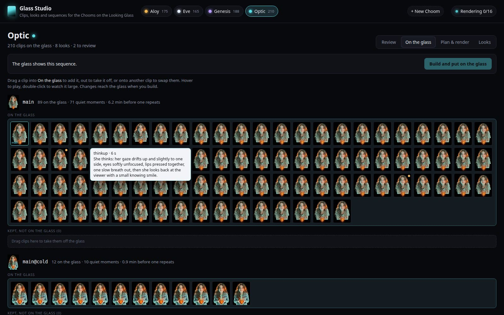

Open it at **http://127.0.0.1:8767** on the computer the Portrait is plugged into. `launch.sh` starts
it with the hologram, and Choom's Settings → Camera links to it. To run it on its own:
`python3 studio/studio.py serve`. Every button explains itself when you hover over it.

**Tutorials**
- [Your first Choom on the glass](docs/tutorial-new-choom.md): from a fresh install to a Choom living
  in the glass, with her own moves.
- [A new outfit for a Choom you have](docs/tutorial-outfit.md): her picture in new clothes, its clips,
  and onto the glass.

## How a Choom is made

A Choom on the glass is a set of short clips that all start and end on the same picture of her, so
the glass can play them in any order without a seam. Each clip has depth on every frame, so she
stands in the glass in 3D, and her lips follow her voice over any clip she talks in.

- **Looks.** A look is one picture of her:
  - her main pose (`main`)
  - Aloy's hand-down pose (`relaxed`)
  - full body (`full`)
  - asleep (`asleep`)
  - outfits (`main@evening`, `relaxed@cold`)
  - other looks (Genesis without her motes, `main@plain`)
- **Clips.** A clip's name says what it's for, using the roles in `tools/clip_roles.py`:
  - `idle_glance`: a quiet moment
  - `listen`: listening
  - `talk_nod`: a calm loop to talk over
  - `pose_wink`: a move for a selfie
  - `evening-idle_glance`: the same quiet moment in her evening outfit

  The Studio names the clips it plans, so you never have to.
- **Her project file** (`studio/<id>.json` in the workspace) keeps every look and every clip, with its
  prompt, seed and whether it was kept, plus the list of clips on the glass.

## The pages

### Review

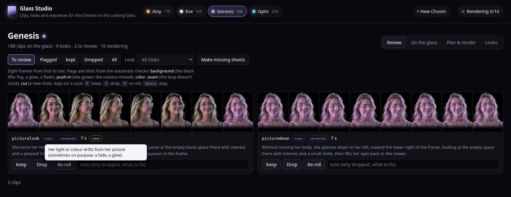

Every new clip arrives as a contact sheet, eight frames from first to last; click it to watch the
clip. The automatic checks flag the ways clips go wrong on the glass:

| Flag | What it means |
|---|---|
| **background** | the black around her lifts: fog, a glow, a flash |
| **push-in** | she grows in the frame: the camera moved |
| **color** | her light or colour drifts (sometimes on purpose: Genesis's motes fading) |
| **seam** | the last frame doesn't come back to the first |
| **cut** | a sudden jump: a new shot |

The limits were set on the four Chooms' first 784 clips. They flag 38 of the 46 clips dropped by
eye; the other 8 were dropped for taste. They flag about 3% of the keepers. About one clip in six
fails, so watch them all.

- **Keep** (K), **Drop** (D) or **Re-roll** (R). A re-roll renders again with a new seed, and you can
  edit the wording first. The old take is kept in `clips/takes/`.
- **Flagged** lists clips the checks were unsure about, kept ones included.

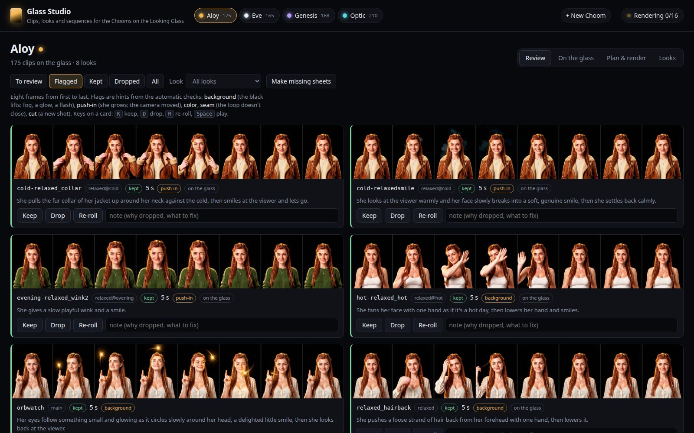

### On the glass

Each look lists its clips on the glass and its kept clips that aren't, with how many minutes of
quiet moments she has before one repeats.

- Drag a clip in to add it, out to take it off, or onto another to swap them.
- **Put all on the glass** adds a look's kept clips at once.
- Hover over a clip to play it; double-click to watch it large.
- **Build and put on the glass** makes cut-outs, depth and reliefs for the new clips only, reloads the
  glass once no Choom is talking, and then clears the old videos.

### Plan & render

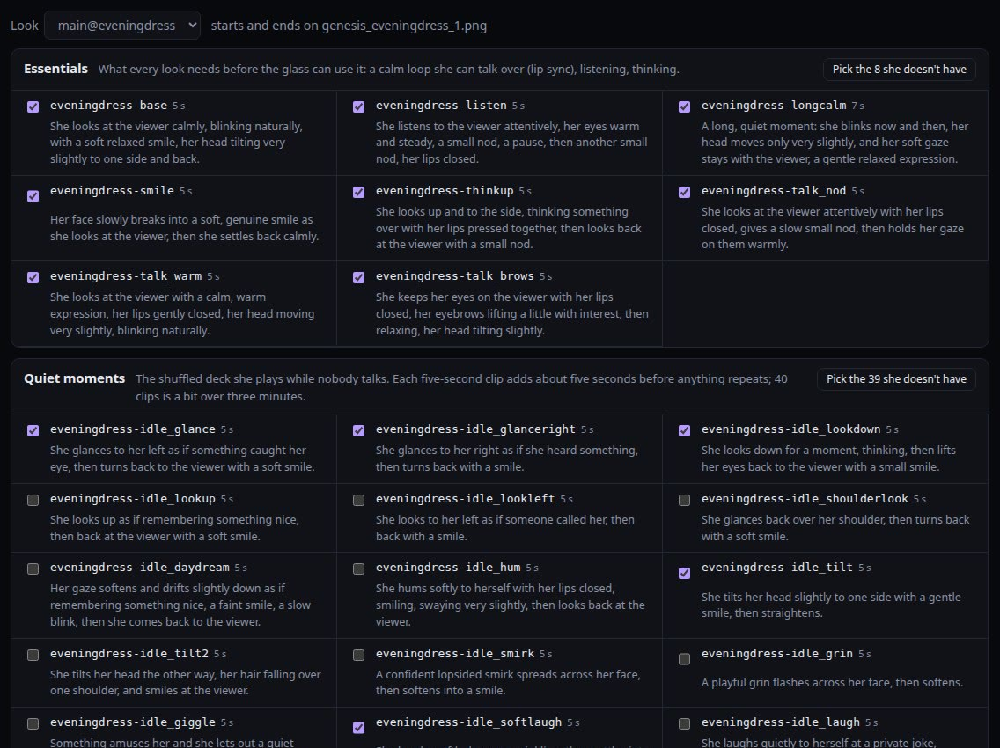

Choose a look and pick actions from the library. Clips she already has are marked.

| Pack | What's in it |
|---|---|
| Essentials | the loop she talks over, listening, thinking |
| Quiet moments | about 40 small things she does while nobody talks |
| Expressions | happy, surprised, sad, concerned |
| Oops | her face at her own mishap |
| Sleep | dozing off, sleeping, waking, a yawn |
| Selfie moves | look-at-me moves for a picture she made |
| Full body | moves and twirls for her full-body look |
| Big moves | longer full-body moves, 7 to 15 seconds: dances, turning her back to you, a curtsy, tai chi |
| Picture looks | turning to a picture beside her |
| Pose changes | moving between two poses |

**Write your own clip** takes any move that ends where it began: a dance, turning her back to you and
turning around again, a kiss. It runs 5 to 15 seconds.

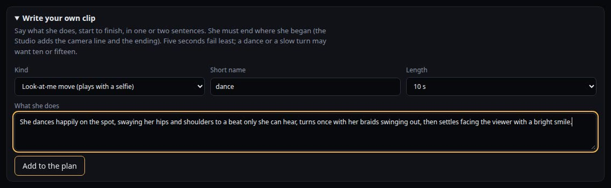

Each prompt is built from the look's subject line, its keep line, the action, the camera line and the
loop ending. Wording that has gone wrong before gets a warning:
- naming an effect you don't want
- breathing words, which bring fog
- "leans in", which pushes the camera in

Then **Render now**, or **Schedule** a time tonight. The glass runs slower while the GPU renders.

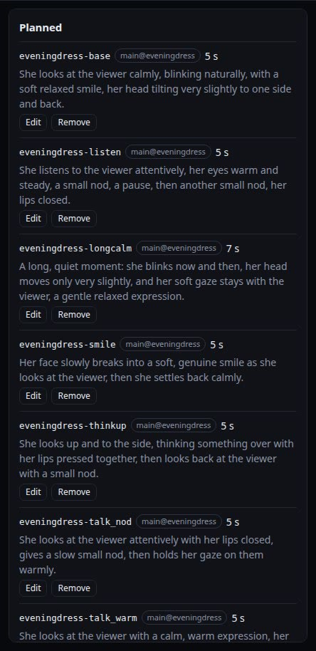

The work list at the top right shows progress. Renders and builds take turns on the GPU; checks run
beside them. A render keeps going if the Studio closes, and the Studio picks it up again when it
restarts.

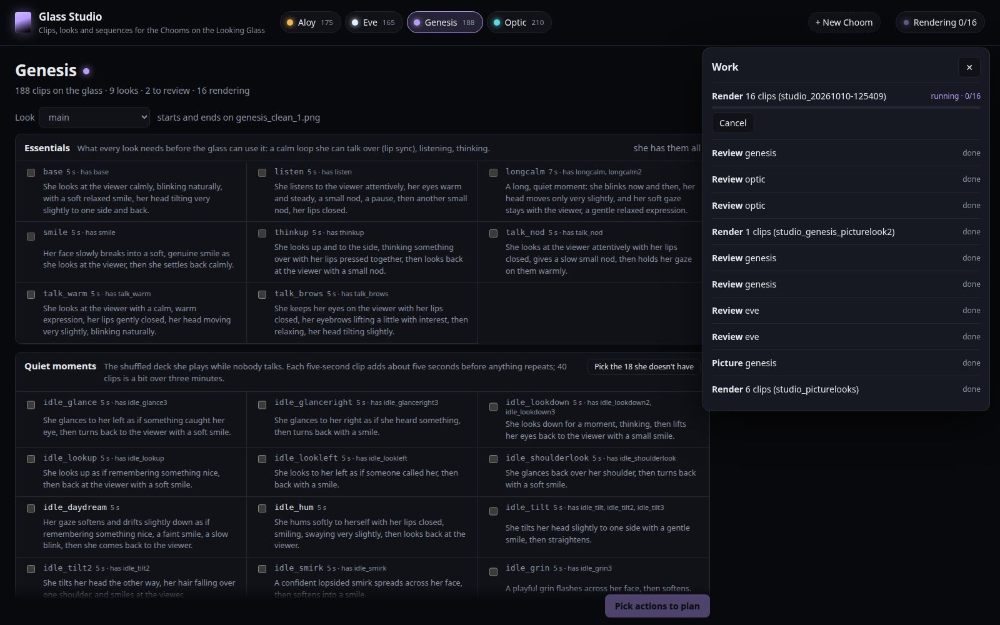

### Looks

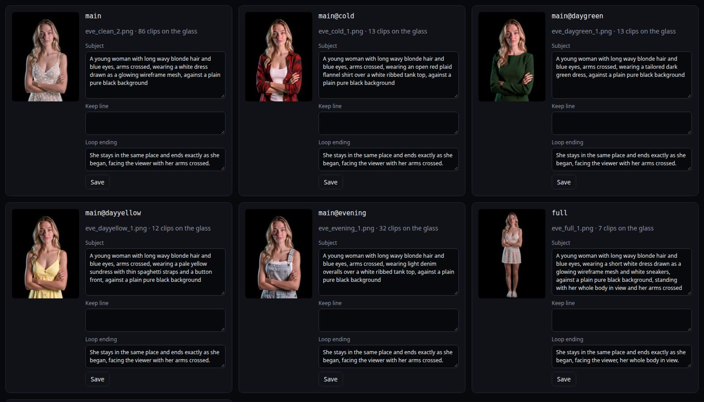

Each look has its picture and three lines:
- **Subject:** who she is in this look. It starts every prompt and says "a plain pure black
  background".
- **Keep line:** said in every clip of the look, like Genesis's motes staying on her.
- **Loop ending:** how she ends every loop.

**New look** makes a new picture with Flux.2 Klein from one she has: an outfit, her full body, or her
asleep. Klein makes a few versions and you pick one.

| | |
|:---:|:---:|
| 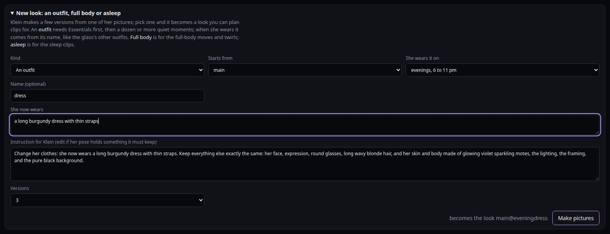 | 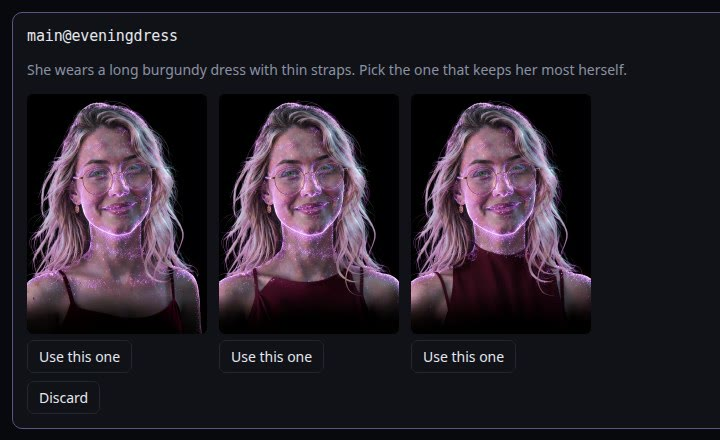 |
| Describe the outfit and when she wears it | Pick the version that keeps her most herself |

An outfit's name tells the glass when she wears it (`OUTFIT_RULES` in `living.js`):

| Name | When |
|---|---|
| `evening…` | 6 to 11 pm |
| `cold…` | under 45°F |
| `hot…` | over 85°F |
| `day…` | a different day outfit each day, taking turns with her usual clothes |

She wears an outfit in visits of about 30 seconds per clip it has, then goes back to her usual
clothes for a while.

### What the Chooms can ask for

The Chooms can ask the glass for things themselves, with three tools in the Choom app (the
looking-glass skill):

| Tool | What it does |
|---|---|
| `glass_move("a little dance")` | plays a move at her next quiet moment, once |
| `glass_wear("my red dress")` | changes her clothes at her next quiet moment; she keeps them on until bedtime, or until she changes again |
| `glass_closet()` | lists her moves and the clothes in her closet, never what she has on |

The glass answers from what's built:
- **Moves** are her selfie moves, her full-body clips, and clips named for a move: a dance, a wave,
  a kiss, a curtsy. "Spin around" finds a twirl, and "flip my hair" finds a hair flip.
- **Clothes** match an outfit's **closet words**. They're read from what she wears in the look
  ("dress, burgundy, red"). You can change them on the look's card. A garment she names must be in
  the outfit; colour breaks ties, so "the red dress" finds the burgundy one. If two outfits fit
  equally, the glass picks one at random.

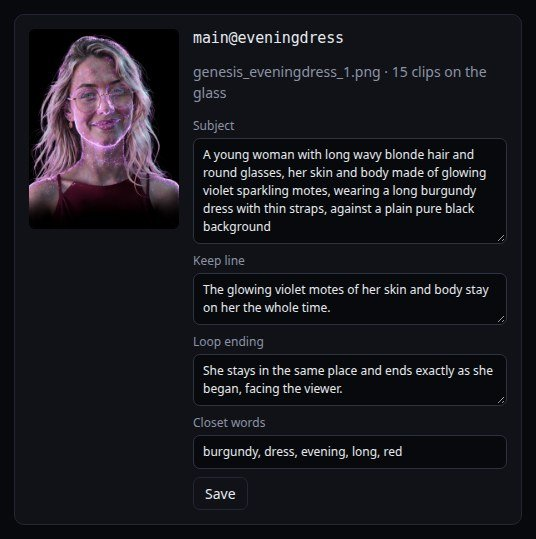

Something she asks for and hasn't got becomes a **wish**. Her wishes show at the top of Plan &
render. Each has a button to start making it: **Write it** opens Write your own clip, and **New
outfit** opens New look with her words filled in. **Let go** takes a wish off the list once it's made,
or if it won't be.

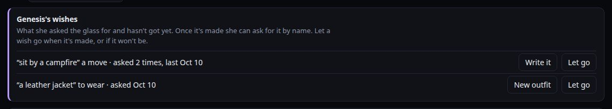

The request goes down the hologram's feed and the hologram's server answers it, the way the glass
camera's requests work, so the NUC opens no port. The matching is in `tools/closet.py`, and the Studio
writes `portraits/<id>/closet.json` when a look's words change and on every build. To try a request
by hand, use the hologram's test hook:
`curl -X POST 127.0.0.1:8765/glass -d '{"choom":"genesis","op":"move","what":"twirl"}'`. To forget
every Choom's chosen clothes, use `curl -X POST 127.0.0.1:8765/control -d '{"glassReset":true}'`.

### A new Choom

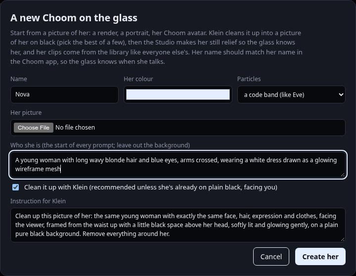

**+ New Choom** starts from a picture of her:
1. Klein cleans the picture up into her main picture on black.
2. **Put her on the glass** makes her still relief and adds her to `portraits/manifest.json`:
   - her cut-out (`tools/make_masks.py <id> <picture>`)
   - depth and plate (`tools/make_depth.py <id> <picture> <name> <colour> <style>`)
   - her mouth (`tools/make_landmarks.py <id>`)

   "OK <name>" at the tower reaches her. A name Whisper mishears can list other spellings in her
   manifest entry's `wake`.
3. Her clips come from the library like everyone else's.

The [tutorial](docs/tutorial-new-choom.md) walks through all of it.

## Setup

- The hologram running on a Looking Glass Portrait ([hologram README](../README.md)).
- [Wan2GP](https://github.com/deepbeepmeep/Wan2GP) with MiniMax H3 (`minimax_h3_fl2va_pdd`) for clips
  and Flux.2 Klein 9B for pictures. Its venv also has rembg (U2-Net) and numpy, which the cut-outs and
  checks use.
- A Python with Depth Anything V2 and MediaPipe for `tools/make_alive.py` (Forge Neo's venv here).
- A GPU with room for H3: about 5½ minutes per five-second clip on an RTX PRO 6000 Blackwell.

Paths go in `~/.config/choom-hologram/studio.json`. Any key you leave out uses the default in
`config.py`:

```json
{
  "workspace": "~/choom-studio",
  "wan2gp": "~/pinokio/api/wan2gp/app",
  "forge_python": "~/pinokio/api/forge-neo/app/venv/bin/python",
  "minutes_per_clip": 5.5,
  "port": 8767
}
```

The workspace holds four folders. Back it up; clips take hours to make.

| Folder | What's in it |
|---|---|
| `clean/` | each look's picture, plus Klein's versions in `drafts/` |
| `clips/` | every rendered clip, with older takes in `takes/` |
| `queue/` | render queues and their logs |
| `studio/` | one project file per Choom, the contact sheets, the work list |

## Command line

Everything on the page also works from a terminal:

```
python3 studio/studio.py status                       # every Choom: clips, looks, what's on the glass
python3 studio/studio.py packs optic main             # the library's actions for a look
python3 studio/studio.py plan optic main quiet        # plan the quiet moments she doesn't have yet
python3 studio/studio.py render optic                 # queue her planned clips and render them
python3 studio/studio.py review optic                 # sheets and checks for new renders
python3 studio/studio.py keep optic optic_idle_glance
python3 studio/studio.py place optic optic_idle_glance
python3 studio/studio.py build optic                  # put her sequence on the glass
```

To adopt clips made before the Studio, run `studio/import_existing.py`. It reads the old render
queues (`queue/<name>.zip` with `<name>_plan.json`) for each clip's prompt and seed, and the glass's
`alive.json` for what's on the glass.

## Files

| File | What it does |
|---|---|
| `studio.py` | command line |
| `server.py` | the page's server and API (standard library only) |
| `project.py` | a Choom's project file: looks, clips, statuses, sequence |
| `prompts.py` | prompt shape, clip lengths, and the wording checker |
| `packs.json` | the clip library |
| `plan.py` | turns library actions into named, seeded clips |
| `render.py` | Wan2GP queue zips, the headless run, collecting outputs by seed |
| `review.py` | contact sheets and automatic checks (needs numpy) |
| `pictures.py` | Klein edits for new looks (outfits, full body, asleep, a new Choom) |
| `build.py` | still reliefs for new Chooms; masks, depth and reliefs; relaunch; prune |
| `jobs.py` | the GPU and CPU work lists |
| `web/` | the page |
| `docs/` | the tutorials and their screenshots |

## Not yet

- **Looks that change more than clothes, on screen.** Genesis's plain look fades her motes away and
  back, and Optic's no-heart look dissolves her heart; both work. A new look of this kind needs change
  clips named in `tools/clip_roles.py` and an entry in `ALT_LOOKS` in `living.js`. The Studio can
  render the clips but can't yet add the entry.
- **Moves between poses:** walking off and vanishing, sitting down in a chair. They need new poses on
  the glass and clips between them.
- **Moves that need another pose on request:** a Choom can ask to sit by a campfire, but until the
  glass has a seated pose, that request becomes a wish.
