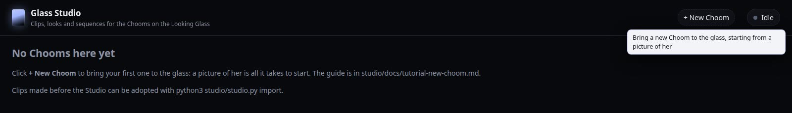
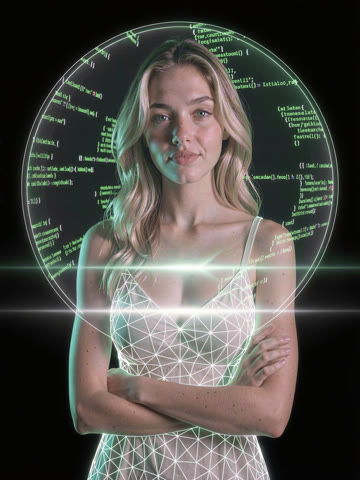
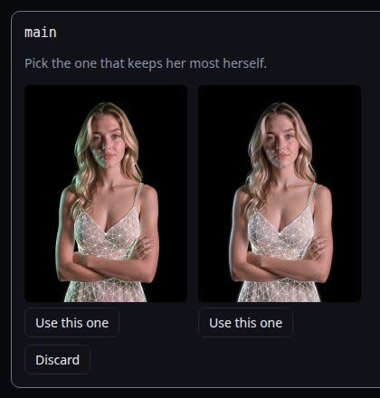
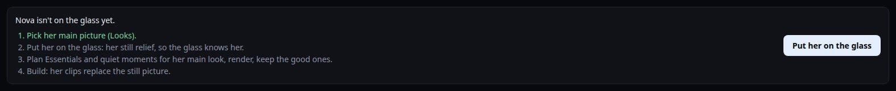
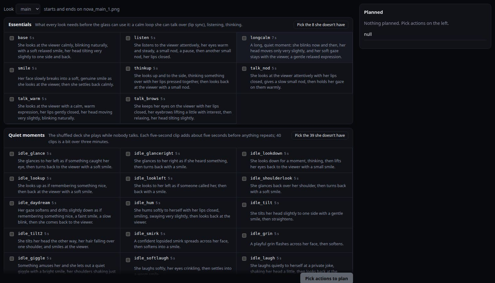
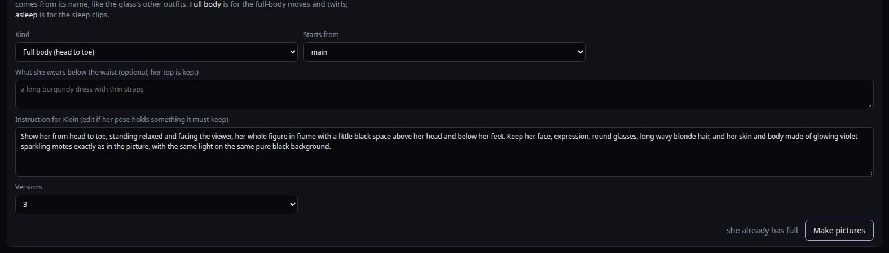

# Tutorial: your first Choom on the glass

This starts from a fresh install with no Choom on the glass yet, and ends with her living in it:
moving, talking with lip sync, with a few dozen moments of her own and room to grow. Screenshots
show Donny's Chooms. The new-Choom steps use Eve's original render as the example; her real Klein
clean-ups appear as the versions.

**Time:** an evening of setup, then a night of rendering for her first clips, then about half an
hour of review and building. After that she grows a little at a time, a few clips or an outfit at a
go.

---

## Part 1: before the Studio

### What you need

- **A Looking Glass Portrait**, connected by HDMI (picture) and USB-C (power, calibration, buttons).
- **A PC with a big NVIDIA GPU.** Clips are made by MiniMax H3, a video model. Donny's are made on an
  RTX PRO 6000 Blackwell, at about 5½ minutes per five-second clip, longer while the glass is
  running. Check [Wan2GP](https://github.com/deepbeepmeep/Wan2GP) for what H3 needs on smaller cards.
- **Linux** (Ubuntu here), **Google Chrome**, **Python 3** and **ffmpeg**.
- **A speakerphone** for her voice and microphone, and **a camera** on the glass for eye contact.
  Both are optional.
- **The Choom app**, where your Choom lives: her voice, her memory, her chats. The glass shows
  whoever is talking in it.

### Install the tools

1. **Wan2GP** (easiest through [Pinokio](https://pinokio.co)), with two models downloaded:
   - **MiniMax H3** (`minimax_h3_fl2va_pdd`), which makes her clips
   - **Flux.2 Klein 9B** (`flux2_klein_9b`), which edits her pictures

   Its Python also has rembg (U2-Net cut-outs) and numpy, which the Studio uses.
2. **A Python with Depth Anything V2, PyTorch and MediaPipe** for `tools/make_alive.py`. Donny uses
   Forge Neo's (also from Pinokio). Depth Anything V2 Large's weights go in Wan2GP's
   `ckpts/depth/depth_anything_v2_vitl.pth`.
3. **The hologram:** follow [Setup in the hologram README](../../README.md#setup):
   - copy the Portrait's calibration file
   - add the udev rule for its buttons
   - point it at the Choom app

   Then run `./launch.sh`. It opens the glass and starts Glass Studio.

### Tell the Studio where things are

Create `~/.config/choom-hologram/studio.json`. Leave out any path that matches the default:

```json
{
  "workspace": "~/choom-studio",
  "wan2gp": "~/pinokio/api/wan2gp/app",
  "forge_python": "~/pinokio/api/forge-neo/app/venv/bin/python"
}
```

The workspace keeps every picture, clip and project. Back it up; clips take hours to make.

Open **http://127.0.0.1:8767** in a browser on the same computer.



---

## Part 2: bring her to the glass

### 1. Choose a picture of her

Everything she becomes starts from one picture, so pick a good one:

- **Waist up, facing you**, her face clear and well lit. A render, a portrait or her Choom avatar all
  work.
- **A pose she can hold forever.** Every clip starts and ends on this picture, so arms relaxed,
  crossed, or hands holding something are all fine. Hands mid-gesture aren't.
- **Her signature things in view:** glasses, a pendant, glowing parts, a held object.
- **The background doesn't matter yet.** Klein cleans it up into plain black.



*Eve's original render: a halo of green code behind her and a light streak across her chest. Both had
to go; the glass draws its own effects.*

### 2. Create her

Click **+ New Choom**.


- **Name:** exactly as the Choom app calls her. The glass matches them by name; her id is the name in
  lower case.
- **Her colour:** her name, her picture frames and her particles on the glass.
- **Particles:** drifting motes, warm embers, a scan band or a code band.
- **Her picture.**
- **Who she is:** the line every clip's prompt starts with. Her hair, eyes, skin, what she wears,
  any glow. Leave out the background and her pose; the Studio adds those. For example: *A young woman
  with long wavy blonde hair and blue eyes, arms crossed, wearing a white dress drawn as a glowing
  wireframe mesh.*
- **Clean it up with Klein:** leave it on unless she's already facing you on plain black. The
  instruction can name what to remove, like Eve's halo.

Click **Create her**. Klein makes the versions in a minute or two.

### 3. Pick her main picture

**Looks** shows the versions. Pick the one that keeps her most herself: her face first, then her
outline on clean black.



Then look over her **main** look card under Looks:

- **Subject:** check it describes her and says "a plain pure black background".
- **Loop ending:** say how she ends every loop, for example *She stays in the same place and ends
  exactly as she began, facing the viewer with her arms crossed.*
- **Keep line:** add one if something about her must survive every clip, for example *The glowing
  violet motes of her skin and body stay on her the whole time.*

### 4. Put her on the glass

**On the glass** shows what's left to do:



Click **Put her on the glass**. The Studio makes her **still relief** (a cut-out, depth, the space
behind her, and where her mouth is) and adds her to the glass. The glass reloads once no Choom is
talking, and she's there: still, but in depth. "OK <her name>" at the tower reaches her.

### 5. Plan her first clips

Go to **Plan & render**, look **main**.



- **Essentials** (Pick the 8 she doesn't have):
  - the calm loop she talks over (lip sync goes on top)
  - listening
  - thinking
  - a long calm loop
  - three talking loops

  Without these she can't talk on the glass.
- **Quiet moments**: start with 15 to 25. A glance, a smile, a laugh, a head tilt, looking up as if
  remembering something: the little things that say someone's home. Each five-second clip adds about
  five seconds before anything repeats.

Click **Plan**, then **Schedule** the render for tonight. Twenty-five clips take three or four hours,
and the glass runs slower while the GPU works.

### 6. Review in the morning

**Review → To review**:


Watch each clip (click its frames) and keep the ones where:

- the black stays black, with no fog, glow or flash
- she stays the same size; if she grows, the camera pushed in
- her face stays hers and her hands stay hands
- the last frame matches the first

About one clip in six fails. Re-roll the ones you'd like another try at; you can change the wording
first.

### 7. Build

**On the glass → Put all on the glass** for her main look, then **Build and put on the glass**. Her
clips replace the still picture once the glass reloads. Each look shows how many minutes of quiet
moments she has before one repeats.


She's alive.

---

## Part 3: make her more herself

Add these whenever you like, a few at a time. Each one is: plan, render, review, build.

### More quiet moments

Aim for 60 or more in her main look: about five minutes before anything repeats. The library has
about 40; your own make up the rest.

### Expressions, oops faces and selfie moves

The **Expressions** pack plays when the conversation feels happy, surprised, sad or concerning. The
**Oops** pack plays after one of her tools fails: a wince, a rueful shake of the head, not her sad
face. **Selfie moves** play with a picture she makes of herself. **Picture looks** turn her toward a
picture floating beside her.

### Full body, and sleep

**Looks → New look → Full body** makes a head-to-toe picture from her main one. Add what she wears
below the waist if her main picture doesn't show it.



Then plan the **Full body** pack for the `full` look: shifting her weight, a stretch, looking over her
shoulder, a twirl, a spin. The glass cuts to her whole figure now and then, and for a twirl with a
selfie.

**New look → Asleep** makes her picture with her eyes closed. Plan the **Sleep** pack (from her main
look): dozing off, sleeping, waking, a yawn. She sleeps late at night once things go quiet, and wakes
in the morning or when you talk to her.

### Outfits

Clothes for the evening, cold days, hot days, or a different one each day. See
[the outfit tutorial](tutorial-outfit.md).

### Your own moves: a dance, turning her back to you, anything

**Plan & render → Write your own clip** takes any move she can make and end where she began.


- **Kind:**
  - *Quiet moment* plays while nobody talks.
  - *Look-at-me move* plays with a selfie.
  - *Talking loop* is calm with lips closed; lip sync goes on top.
  - *Oops face* plays after her own mishap.
- **Short name:** becomes part of the clip's name (`dance`, `turnback`, `kiss`).
- **Length:** five seconds fails least. A dance or a slow turn may want 10, 12 or 15.
- **What she does:** what you'd see, start to finish, then how she settles back facing you. Some that
  work:
  - *She turns around slowly until her back is to the viewer, looks back over her shoulder with a
    smile, then turns all the way back to face the viewer.*
  - *She dances happily on the spot, swaying her hips and shoulders to a beat only she can hear, turns
    once with her hair swinging out, then settles facing the viewer with a bright smile.*
  - *She brings her fingertips to her lips and blows the viewer a soft kiss, then smiles warmly.*
  - *She lays one hand flat on her heart for a moment, then lowers it with a soft smile.*

  In the full-body look, the same kinds become full-body moves.

What the video model gets wrong, and how to word around it:

| Avoid | Why | Instead |
|---|---|---|
| "no smoke", "without a glow" | Naming an effect brings it | Say what is there: "a plain pure black background" |
| "a deep breath", "a sigh", "exhales" | Breathing words bring a cloud of fog | Say what her face or shoulders do |
| "leans in", "studies the viewer closely" | Draws the eye to her face, so the camera pushes in | Keep her where she is |
| "walks away", "leaves the frame" | Every clip must end on her picture | Keep the move on the spot |
| A mug that appears, hair that gets tied | Nothing can appear, vanish or change in a loop | Use a new look (picture) for a different hairstyle |
| Hands busy while she holds something | The held thing melts or moves | Say how she frees a hand and puts it back |

The Studio warns about most of these when you plan.

### Ideas that need more than the Studio has yet

Some moves don't start and end on her picture:

- walking off and vanishing, then appearing again
- pulling up a chair and sitting down for a while

These need new poses on the glass (gone, seated) and clips that move between them, like Aloy
lowering and raising her hand. The video model handles them; the glass doesn't play them yet.

---

## When something's wrong

| What you see | What to check |
|---|---|
| The Studio page doesn't open | Is it running? `python3 studio/studio.py serve` from the hologram folder; is port 8767 free? |
| Klein made no pictures | The work list's error, and `clean/drafts/run_*/wan2gp.log`; check the `wan2gp` path in studio.json |
| A render stops partway | `queue/<name>.log`. Clips that didn't render go back to planned; render them again |
| Build fails | The work list shows the failing step's output; check `forge_python` in studio.json |
| She isn't on the glass | Did *Put her on the glass* finish? `portraits/manifest.json` should list her |
| She doesn't talk on the glass | Her name in the Studio must match her name in the Choom app |
| The glass is slow | A render or build is using the GPU; schedule renders for the night |
