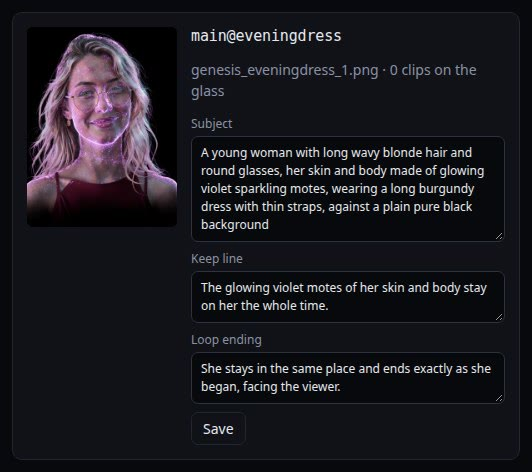
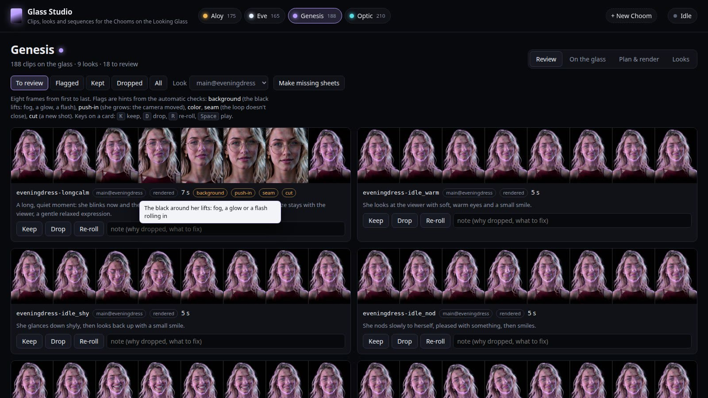
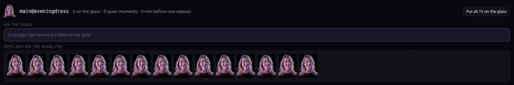
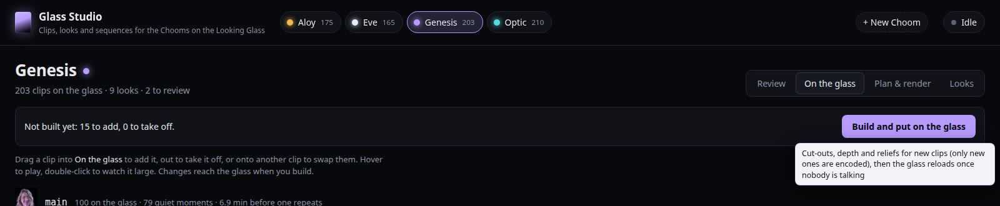

# Tutorial: a new outfit for a Choom you have

This walks through a whole outfit, from her new picture to its clips playing on the glass. The
example is the real one: Genesis's long burgundy dress for evenings, made in Glass Studio on
October 10, 2026. The screenshots show Donny's Chooms.

You need a Choom who is already on the glass (her main look and some clips). For a Choom who isn't
there yet, start with [the new-Choom tutorial](tutorial-new-choom.md).

**Time:** about five minutes of your own, then a few hours of rendering, which is best done
overnight. Then about fifteen minutes to review the clips.

---

## 1. Describe the outfit

Open the Studio (http://127.0.0.1:8767), click her name at the top, and go to **Looks**. Open
**New look: an outfit, full body or asleep**.

- **Kind:** *An outfit*.
- **Starts from:** the picture Klein edits. Klein keeps everything but the clothes. Use the look her
  other outfits were made from; it's chosen for you.
- **She wears it on:** when the glass puts her in it.

  | Choice | When |
  |---|---|
  | evenings | 6 to 11 pm |
  | cold days | under 45°F |
  | hot days | over 85°F |
  | daytime | a different day outfit each day, taking turns with her usual clothes |

  The outfit's name carries this (`evening…`), which is how the glass decides.
- **Name:** tells two outfits for the same time apart: `dress` makes the look `main@eveningdress`.
- **She now wears:** the clothes, as you'd describe them to someone: *a long burgundy dress with thin
  straps*. Colour, fabric and cut help; brand names and moods don't.
- **Instruction for Klein:** written for you from what her earlier outfit edits kept (her face, hair,
  glasses, motes). If her pose holds something, like Optic's heart or crossed arms, make sure the
  instruction keeps it.

Click **Make pictures**. Klein makes the versions in a minute or two. If a render is running,
Klein waits for it to finish.

## 2. Pick the version that keeps her most herself

The versions appear at the top of Looks. Click one to see it large.

Look at her face first: the same eyes, the same smile. Then the clothes. Then the edges: a clean
outline on pure black, nothing new floating beside her. Version 2 matched the brief best here (clearly
burgundy, thin straps). Click **Use this one**.

If none are right, change the wording and make more, or **Discard** them.

## 3. Check the new look

It's now a look of its own, with the picture and the line that starts every prompt in it. The
Studio writes that line from the line her other outfits share, with the new clothes in the middle:

- **Subject:** *A young woman with long wavy blonde hair and round glasses, her skin and body made of
  glowing violet sparkling motes, wearing a long burgundy dress with thin straps, against a plain
  pure black background.* Keep "a plain pure black background".
- **Keep line:** said in every clip of the look. For Genesis it's that her motes stay on her.
- **Loop ending:** how she ends every loop, facing the viewer exactly as she began.

Fix anything here before planning, because the clips are written from it.

## 4. Plan the clips

Go to **Plan & render** and choose the new look at the top.

- **Essentials first.** An outfit can't go on the glass without a loop she can talk over (the base
  loop, with lip sync on top), listening and thinking. **Pick the 8 she doesn't have** ticks them all.
- **Then quiet moments**: the shuffled deck she plays while nobody talks. Each five-second clip adds
  about five seconds before anything repeats.
  - Eight or more makes a good first set.
  - She wears an outfit in visits of about 30 seconds per clip it has, so more clips mean longer
    visits.
  - Actions marked **uses a hand** need a word about how she frees the hand and puts it back, if her
    pose holds something.

Click **Plan 16 clips in main@eveningdress**. Each clip gets its name, its prompt and a seed nobody
has used.

## 5. Check the plan and render

The planned clips are listed on the right, each with its action and any wording warnings, along with
how long the render will take. To change what a clip does, click **Edit**. Each warning names the
words that went wrong before (breathing words bring fog; "leans in" makes the camera push in).

Click **Render now**, or set a time and **Schedule** it for tonight. The glass runs slower while the
GPU renders, so night is kinder. The work list at the top right shows progress; click it for details,
or to cancel (anything not yet rendered goes back to planned).

Each clip shows up in Review as soon as it's done, with its contact sheet and checks, while the rest
keep rendering.

## 6. Review every clip

**Review → To review**, with the look chosen:

Each card shows eight frames, first to last. Click the frames to watch the clip. Look for:

- **The black staying black.** Fog, a glow or a flash rolling in shows on the glass as a cloud.
- **Her size staying the same.** If she grows, the camera pushed in.
- **Her face staying hers**, and her hands staying hands.
- **The last frame matching the first**, so the loop closes without a jump.

The flags (background, push-in, color, seam, cut) are hints from the automatic checks. About one clip
in six fails. For the dress, 15 of 16 came out clean. The seven-second long-calm loop pushed in, lost
her motes and snapped back at the end; it was flagged four ways and dropped. Use **Keep** (K), **Drop** (D), or **Re-roll** (R), which renders the same prompt again
with a new seed. A re-rolled clip can have its wording changed before it renders again. The old take
is kept in `clips/takes/`.

## 7. Put the outfit on the glass

**On the glass** lists each look's clips on the glass and its kept clips that aren't.
**Put all on the glass** moves a look's kept clips over in one go. You can also drag clips one at a
time, drag one out to take it off, or drop one onto another to swap them. Hover over a clip to play it.

The bar at the top shows what changed since the glass was last built. Click **Build and put on the
glass**:

1. The Studio makes the new clips' cut-outs and depth. Only new clips are processed; that takes about
   a minute each.
2. The glass reloads once no Choom is talking.

The outfit appears at its hour, in short visits.

---

## Tips

- **One outfit at a time.** Render it, review it, build it, then start the next.
- **Short clips fail less.** Five seconds is the sweet spot. Longer clips (up to 15 s, for a dance)
  drift more into new shots and colour shifts.
- **An outfit-specific moment** makes it feel worn: Genesis tugging the sweater back onto her
  shoulder, Aloy pulling up her jacket collar. Add one with **Write your own clip** on the Plan page.
- **The Chooms can know their closet.** They aren't told what they're wearing at any moment, since
  that would steer every picture they make. Telling them what their closet holds is fine.
